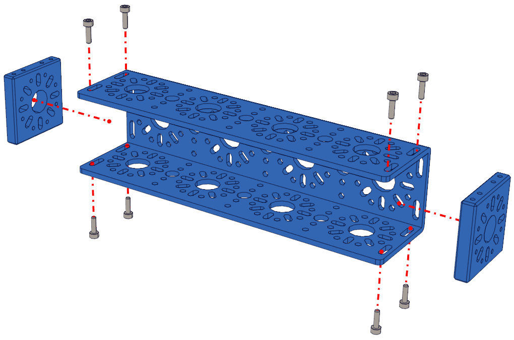

Step 1: Start Build
===================

.. list-table:: Parts Required for Step 1
        :widths: 50 25 25 150
        :header-rows: 1
        :align: center

        * - Name
          - Part #
          - Qty
          - Image
        * - 192mm U-Channel
          - 76015
          - 2
          - .. image:: images/bom/192-u-channel.png
              :align: center
              :width: 25%
        * - End Piece Plate
          - 76015
          - 4
          - .. image:: images/bom/end-plate.png
              :align: center
              :width: 20%
        * - M3 x 10mm SHCS
          - 76201
          - 16
          - .. image:: images/bom/m3-10-shcs.png
              :align: center
              :width: 15%

Instructions
------------

- Slide the End Piece Plate into the end of the 192mm U-Channel.
- Using an M3 x 10mm SHCS screw from the outside of the 192mm U-Channel into the tapped holes of the End Piece Plate. The 2.5mm Hex Key (Green) is the tool to use here. 
- Repeat this process for the other side of the 192mm U-Channel.
- The End Piece Plate should sit flush with both ends of the channel. 
- **Once one channel is complete, repeat the process with the other 192mm U-Channel and two other End Piece Plates.**

