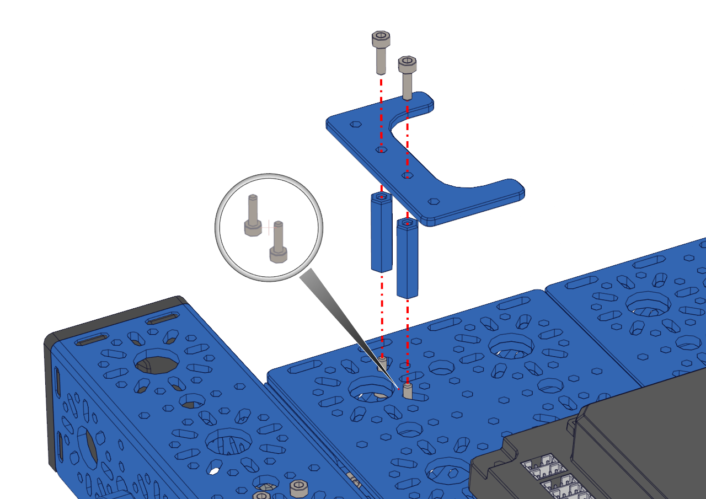

Step 11 - Battery Clip 1
========================

.. list-table:: Parts Required for Step 11
        :widths: 50 25 25 150
        :header-rows: 1
        :align: center

        * - Name
          - Part #
          - Qty
          - Image
        * - Completed Assembly from Part 10
          - 
          - 1
          - 
        * - M3 x 10mm SHCS
          - 76201
          - 4
          - .. image:: images/bom/m3-10-shcs.png
              :align: center
              :width: 10%
        * - 25mm Standoff
          - 76182
          - 2
          - .. image:: images/bom/25-standoff.png
              :align: center
              :width: 15%
        * - Battery Clip
          - 76088
          - 1
          - .. image:: images/bom/battery-clip.png
              :align: center
              :width: 15%

Instructions
------------

- From inside the back 192mm U-Channel, use 2 M3 x 10mm SHCS to screw into 2 25mm Standoffs. 
- Place the battery clip on top of the standoffs and screw them in with the other 2 M3 x 10mm SHCS.

