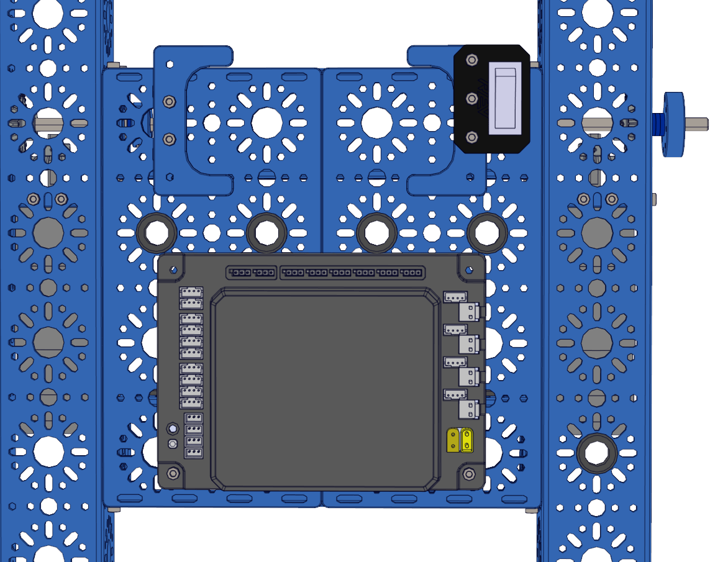

Step 14 - Wire Grommets 2
=========================

.. list-table:: Parts Required for Step 14
        :widths: 50 25 25 150
        :header-rows: 1
        :align: center

        * - Name
          - Part #
          - Qty
          - Image
        * - Completed Assembly from Part 13
          - 
          - 1
          - 
        * - Rubber Grommet
          - 76504
          - 5
          - .. image:: images/bom/wire-grommet.png
              :align: center
              :width: 10%

Instructions
------------

- Press five wire grommets into the large holes as shown in the picture below.

