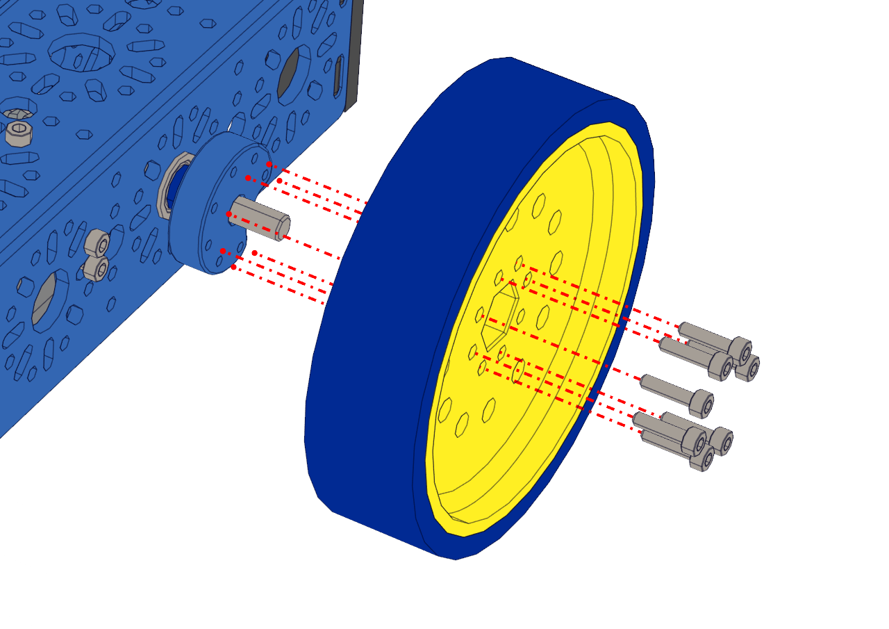

Step 15 - Drive Wheels
======================

.. list-table:: Parts Required for Step 15
        :widths: 50 25 25 150
        :header-rows: 1
        :align: center

        * - Name
          - Part #
          - Qty
          - Image
        * - Completed Assembly from Part 14
          - 
          - 1
          - 
        * - 100mm Drive Wheel
          - 76262
          - 2
          - .. image:: images/bom/drive-wheel.png
              :align: center
              :width: 15%
        * - M3 x 12mm SHCS
          - 76202
          - 14
          - .. image:: images/bom/m3-12-shcs.png
              :align: center
              :width: 10%

Instructions
------------

- Using 7 M3 x 12mm SHCS, screw the drive wheel into the light Weight shaft hub.
- Repeat for the other side.

