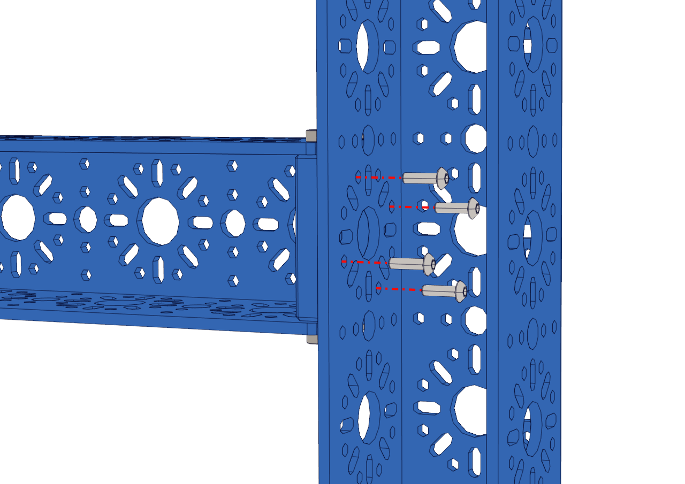
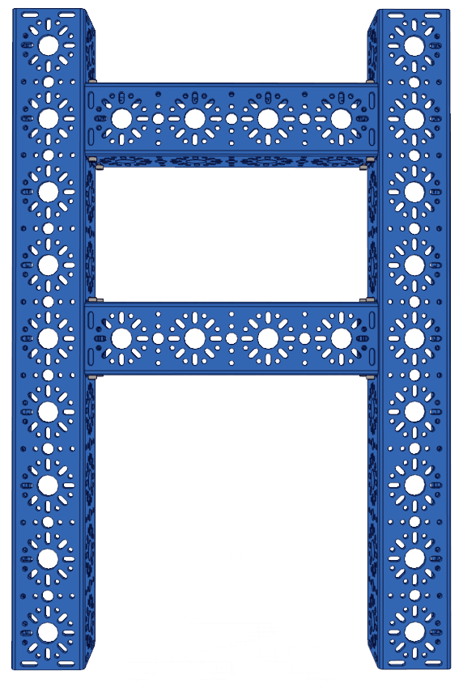

Step 2 - Chassis Frame
======================

.. list-table:: Parts Required for Step 2
        :widths: 50 25 25 150
        :header-rows: 1
        :align: center

        * - Name
          - Part #
          - Qty
          - Image
        * - Completed Assembly from Part 1
          - 
          - 2
          - 
        * - 432mm U-Channel
          - 76010
          - 2
          - .. image:: images/bom/432-u-channel.png
              :align: center
              :width: 40%
        * - M3 x 10mm BHCS
          - 76203
          - 16
          - .. image:: images/bom/m3-10-bhcs.png
              :align: center
              :width: 10%

Instructions
------------

- Align the 192mm U-Channel with the 432mm U-Channel as shown in the picture on the right.
- Using 4 M3 x 10mm BHCS, screw the 432mm U-Channel into the End Piece Plate on the 192mm U-Channel, as shown in the left picture. M3 BHCS requires the 2mm Hex Key (Pink).
- Do not fully tighten the screws yet. They should be loose so the chassis can be straightened later. 
- Repeat the process for the other three End Piece Plates connected to the 432mm U-Channel.
- Once everything is together, use the flattest surface to make all 4 channels as flat as possible.
- With all the channels flat and square to your liking, all 16 M3 x 10mm BHCS can be fully tightened. **Remember to use a star pattern when tightening to get even torque**

.. note:: NEED TO ADD AN IMAGE HERE SHOWING THE HEX KEY GOING THROUGH THE CHANNEL

|pic1| |pic2|

