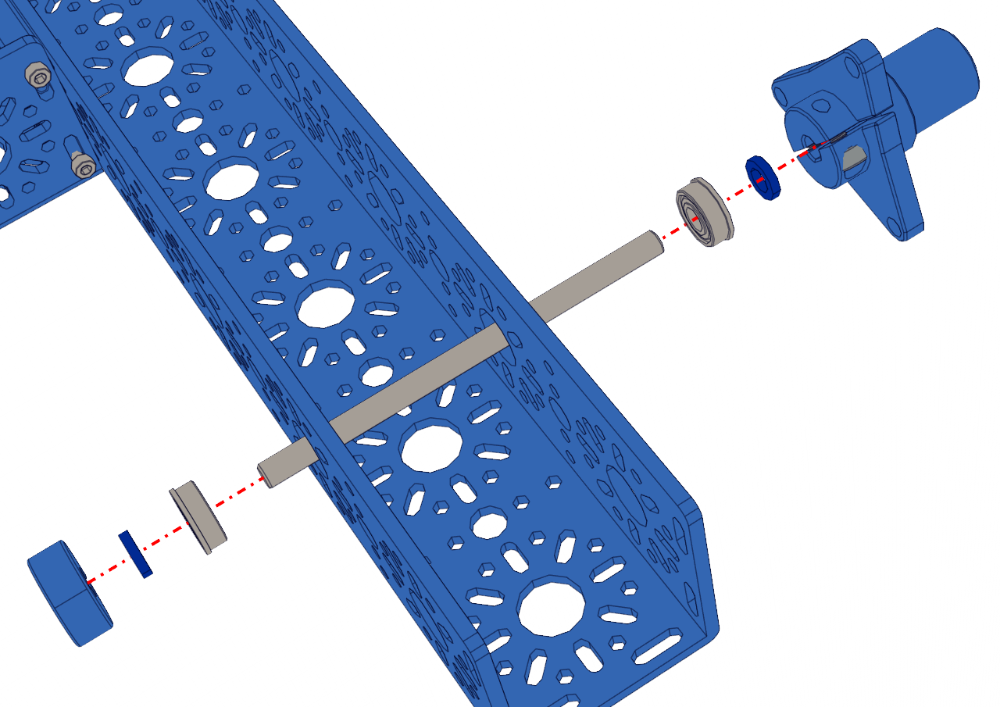

Step 3 - Front Idler Shaft
==========================

.. list-table:: Parts Required for Step 3
        :widths: 50 25 25 150
        :header-rows: 1
        :align: center

        * - Name
          - Part #
          - Qty
          - Image
        * - Completed Assembly from Part 2
          - 
          - 1
          - 
        * - Enhanced Wheel Hub Kit
          - 76291
          - 2
          - .. image:: images/bom/enhanced-hub.png
              :align: center
              :width: 15%
        * - 14mm Flange Bearing
          - 76302
          - 4
          - .. image:: images/bom/14-bearing.png
              :align: center
              :width: 10%
        * - Collar Clamp
          - 76320
          - 2
          - .. image:: images/bom/collar-clamp.png
              :align: center
              :width: 10%
        * - 2mm Shaft Spacer
          - 76306
          - 4
          - .. image:: images/bom/2-spacer.png
              :align: center
              :width: 10%
        * - 6mm x 96mm D-Shaft
          - 76161
          - 2
          - .. image:: images/bom/96-d-shaft.png
              :align: center
              :width: 40% 

Instructions
------------

- Pre-load the M4 x 8mm SHCS into the Enhanced Wheel Hub. **Be careful not to tighten the screws**
- Pre-load the M3 x 8mm SHCS into the Collar Clamp. **Be careful not to righten the screw**
- Place the Collar Clamp on the edge of the 6mm D-Shaft and fully tighten the M3 screw down to clamp the Collar Clamp to the D-Shaft. **Take note to ensure the Collar Clamp and Shaft are flush at one end**
- Slide a 2mm Spacer from the other end of the shaft down to the Collar Clamp.
- Slide the 14mm Bearing from the other end of the shaft down to the spacer. **The Flange of the bearing should be touching the spacer**
- Slide the Shaft into the 2nd 14mm hole on the 432mm U-Channel from the inside, as shown in the left picture. The Collar Clamp should be on the inside of the chassis frame.
- Slide a 14mm Bearing from the outside of the 432mm U-Channel onto the shaft. **The Flange of the bearing should be facing outside**
- Slide a 2mm spacer on the shaft so that it makes contact with the bearing. 
- Slide the Enhanced Wheel Hub onto the shaft and clamp it down using the 3mm Hex Key (Blue).
- The finished assembly should look like the picture on the right. 
- Check to ensure you can spin the Enhanced Wheel hub without any issues. If there are issues, loosen the hub or the collar clamp and try again. The hub should be able to spin smoothly. 
- Repeat the process for the other side of the chassis. There should be two Enhanced Wheel Hubs on the front of the chassis. The Wheel hubs should be on the outside of the chassis.   

|pic1| |pic2|

.. |pic2| image:: images/basicBotChassis_View5.png
    :width: 29%