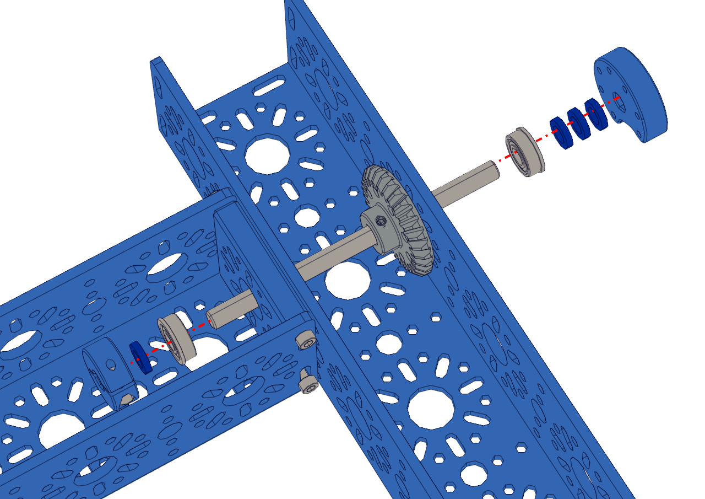
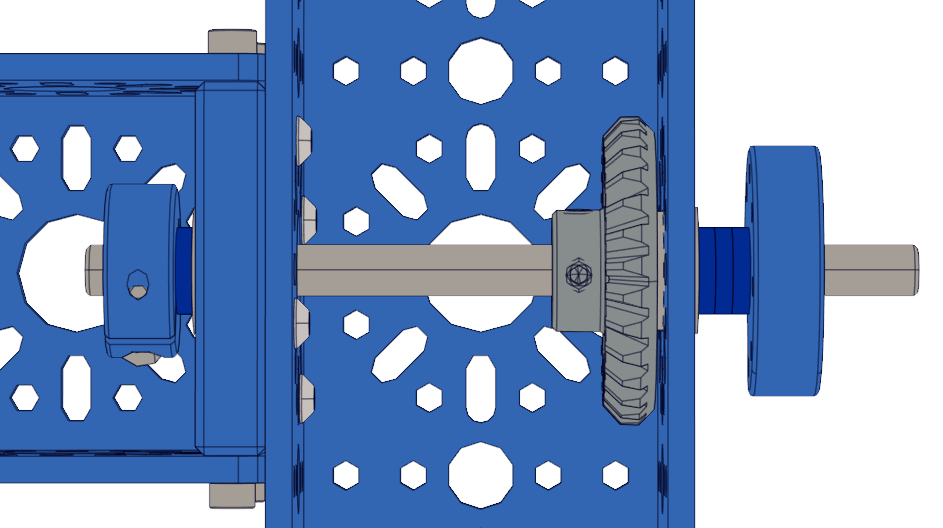

Step 4 - Drive Shaft
====================

.. list-table:: Parts Required for Step 4
        :widths: 50 25 25 150
        :header-rows: 1
        :align: center

        * - Name
          - Part #
          - Qty
          - Image
        * - Completed Assembly from Part 3
          - 
          - 1
          - 
        * - 14mm Flange Bearing
          - 76302
          - 4
          - .. image:: images/bom/14-bearing.png
              :align: center
              :width: 10%
        * - Collar Clamp
          - 76320
          - 2
          - .. image:: images/bom/collar-clamp.png
              :align: center
              :width: 10%
        * - 2mm Shaft Spacer
          - 76306
          - 8
          - .. image:: images/bom/2-spacer.png
              :align: center
              :width: 10%
        * - 6mm x 96mm D-Shaft
          - 76161
          - 2
          - .. image:: images/bom/96-d-shaft.png
              :align: center
              :width: 40% 
        * - 30 Tooth Bevel Gear
          - 76219
          - 2
          - .. image:: images/bom/30-tooth-bevel.png
              :align: center
              :width: 15%
        * - Light Weight Shaft Hub
          - 76282
          - 2
          - .. image:: images/bom/light-hub.png
              :align: center
              :width: 15%

Instructions
------------

- Pre-load the 5mm setscrew into the Light Weight Shaft Hub. **Be careful not to tighten the setscrew all the way** 
- Pre-Load the 4mm setscrews into the 30 Tooth Bevel Gear. **Be careful not to tighten the setscrews all the way**
- Pre-load the M3 x 8mm SHCS into the Collar Clamp. **Be careful not to righten the screw**
- Slide the Collar Clamp onto the 6mm D-shaft and offset it about 2mm away from the edge of the shaft. **Using a 2mm spacer is an excellent way to get the spacing**
- Clamp the Collar clamp down to the D-shaft.
- Slide a single 2mm spacer onto the D-shaft and slide it down to the collar clamp.
- Slide a 14mm bearing down the D-shaft until it makes contact with the spacer. The flange should be touching the spacer. 
- Slide the D-shaft through the End Piece Plate from inside the chassis. 
- Before sliding the shaft all the way through, slide the 30 Tooth Bevel Gear onto the shaft with the setscrew side facing the inside of the chassis. **Do not tighten the setscrews**
- Fully slide the D-Shaft through.
- Slide a 14mm bearing onto the D-shaft with the flange facing the outside. 
- Slide 3 x 2mm spacers onto the D-shaft.
- Slide the Light Weight shaft hub onto the D-shaft and tighten the setscrew. 
- The shaft should be able to spin freely. If there are any issues, loosen the Light Weight Shaft hub or the collar clamp and adjust. 
- Repeat these steps for the other side.

|

