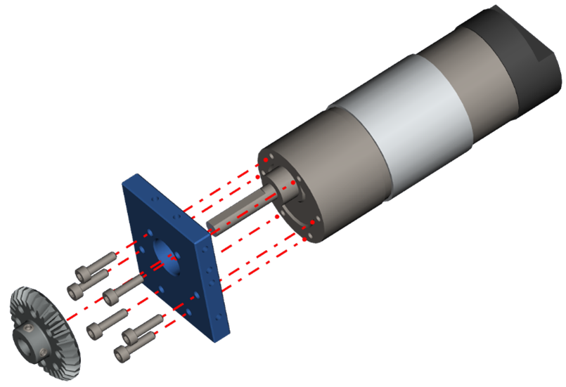

Step 5 - Motor Assembly
=======================

.. list-table:: Parts Required for Step 5
        :widths: 50 25 25 150
        :header-rows: 1
        :align: center

        * - Name
          - Part #
          - Qty
          - Image
        * - NeveRest Classic 40
          - am-4609b
          - 2
          - .. image:: images/bom/neverest-classic.png
              :align: center
              :width: 30%
        * - Motor Mount Plate
          - 76140
          - 2
          - .. image:: images/bom/motor-mount-plate.png
              :align: center
              :width: 15%
        * - 30 Tooth Bevel Gear
          - 76219
          - 4
          - .. image:: images/bom/30-tooth-bevel.png
              :align: center
              :width: 15%
        * - M3 x 10mm SHCS
          - 76201
          - 12
          - .. image:: images/bom/m3-10-shcs.png
              :align: center
              :width: 10%

Instructions
------------

- Pre-Load the 4mm setscrews into the 30 Tooth Bevel Gear. **Be careful not to tighten the setscrews all the way**
- Slide the NeveRest Classic into the Motor Mount plate.
- Using M3 x 10mm SHCS, screw the NeveRest Classic into the Motor Mount Plate.
- Slide the 30 Tooth Bevel gear onto the NeveRest Classic Motor shaft. The set screws should face away from the motor, as shown below. **Do Not fully tighten the setscrews**.
- Repeat these steps for the other NeveRest Classic Motor.

