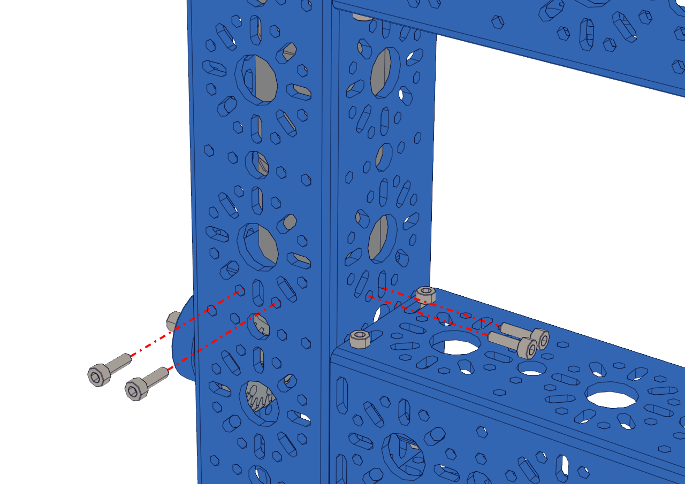
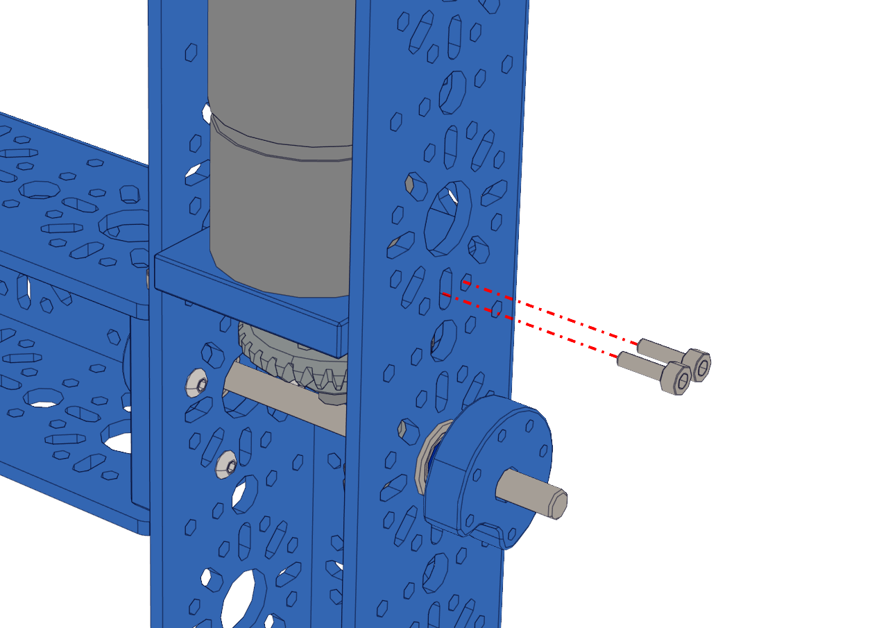

Step 7 - Securing the Motor Bracket
===================================

.. list-table:: Parts Required for Step 7
        :widths: 50 25 25 150
        :header-rows: 1
        :align: center

        * - Name
          - Part #
          - Qty
          - Image
        * - Completed Assembly from Part 6
          - 
          - 1
          - 
        * - M3 x 10mm SHCS
          - 76201
          - 12
          - .. image:: images/bom/m3-10-shcs.png
              :align: center
              :width: 10%

Instructions
------------

- Using the M3 x 10mm SHCS screw in the 6 screws points as shown in the pictures below.
- Once fully tightend, mesh the two bevel gears and tighten the setscrews. **You may need to do one rotate the shaft and repeat to get all 4.**
- Repeat the process for the other side.  

|pic1| |pic2|

