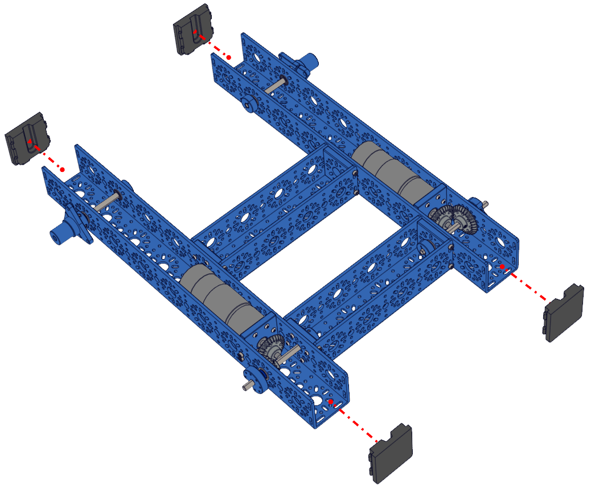

Step 8 - Bumpers
================

.. list-table:: Parts Required for Step 8
        :widths: 50 25 25 150
        :header-rows: 1
        :align: center

        * - Name
          - Part #
          - Qty
          - Image
        * - Completed Assembly from Part 7
          - 
          - 1
          - 
        * - U-Channel Bumper
          - 76505
          - 4
          - .. image:: images/bom/bumper.png
              :align: center
              :width: 20%

Instructions
------------

- Press the U-Channel Bumper into the end slots of the 432mm U-Channel

.. hint:: Sometimes, bending the bumper can help get it in.

