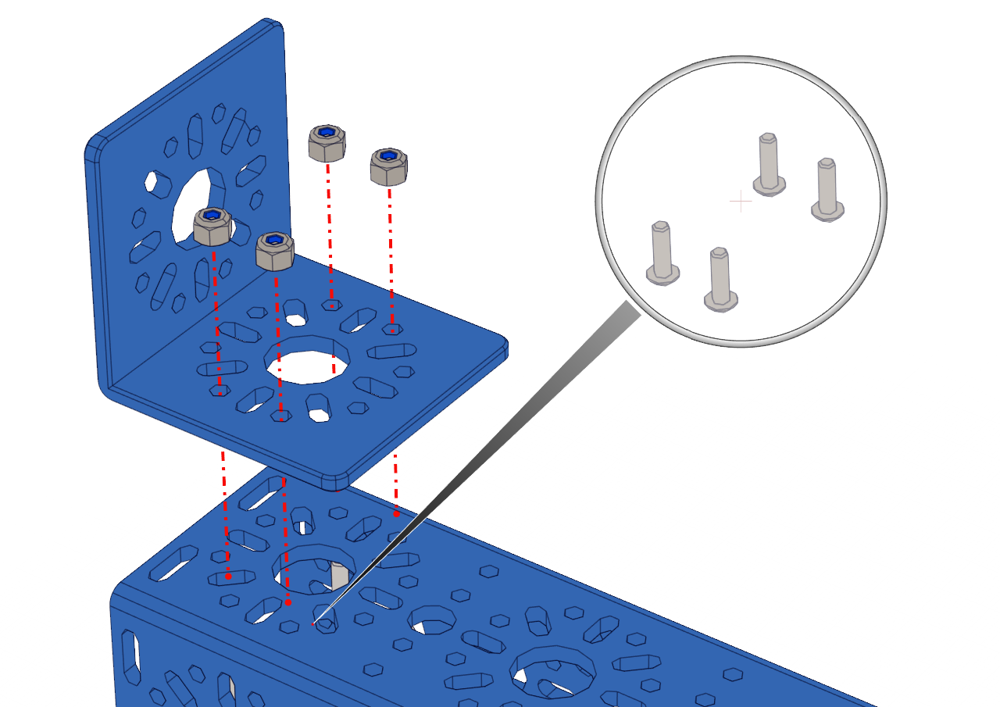

Step 1: Start OMS Build
=======================

.. list-table:: Parts Required for Step 1
        :widths: 50 25 25 150
        :header-rows: 1
        :align: center

        * - Name
          - Part #
          - Qty
          - Image
        * - 240mm U-Channel
          - 76014
          - 1
          - .. image:: images/bom/240mm-uchannel.png
              :align: center
              :width: 40%
        * - L Bracket
          - 76087
          - 1
          - .. image:: ../Chassis/images/bom/l-bracket.png
              :align: center
              :width: 15%
        * - M3 x 10mm BHCS
          - 76203
          - 4
          - .. image:: ../Chassis/images/bom/m3-10-bhcs.png
              :align: center
              :width: 10%
        * - M3 Nyloc
          - 76205
          - 4
          - .. image:: images/bom/m3-nyloc.png
              :align: center
              :width: 10% 

Instructions
------------

- Mount the L Bracket on the outside center end of the 240mm U-Channel.
- 4 x M3 Button Head Cap Screws are required along with 4 M3 Nyloc nuts. 
- The L Bracket and the edge of the 240mm U-Channel should be flush.

