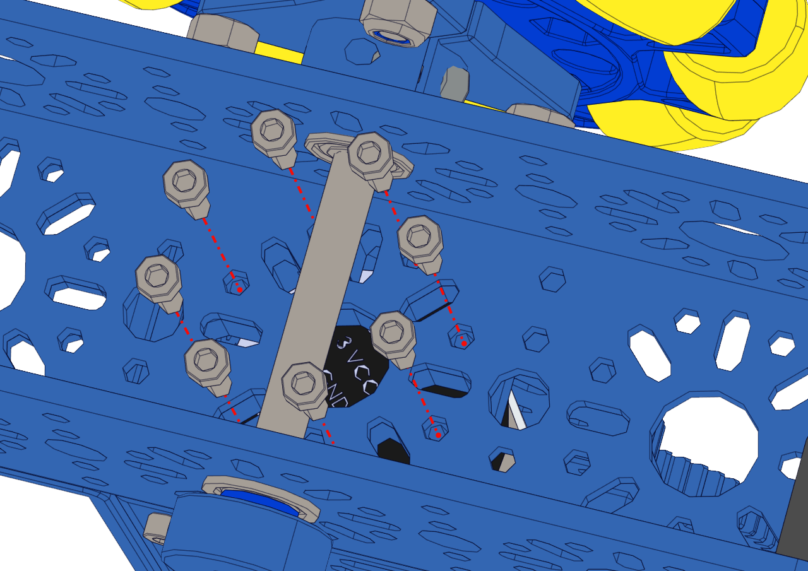

Step 10:
========

.. list-table:: Parts Required for Step 10
        :widths: 50 25 25 150
        :header-rows: 1
        :align: center

        * - Name
          - Part #
          - Qty
          - Image
        * - Completed Chassis Assembly
          - 
          - 1
          - 
        * - Completed Assembly from Step 9
          - 
          - 1
          - 
        * - M3 x 10mm SHCS
          - 76201
          - 8
          - .. image:: ../Chassis/images/bom/m3-10-shcs.png
              :align: center
              :width: 10%

Instructions
------------

- Place the arm assembly as shown on the right side of the basic bot chassis.

.. figure:: images/BasicBot16.png
      :align: center
      :width: 50%

|

- From the bottom inside of the chassis, screw the chassis to the End Piece Plate of the arm assembly using 8 x M3 SHCS.

|pic1| |pic2|

.. |pic2| image:: images/BasicBot18.png
    :width: 40%