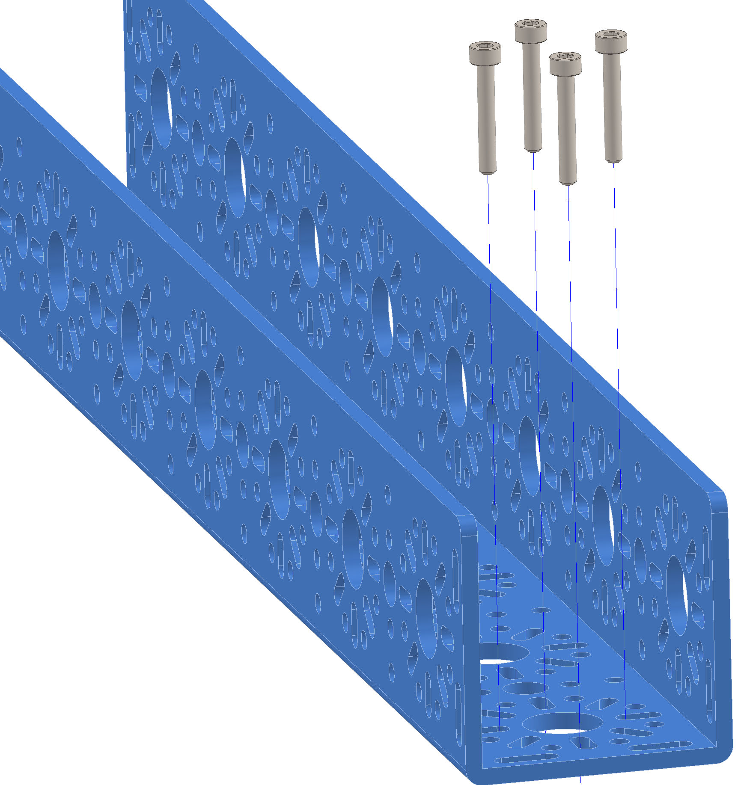
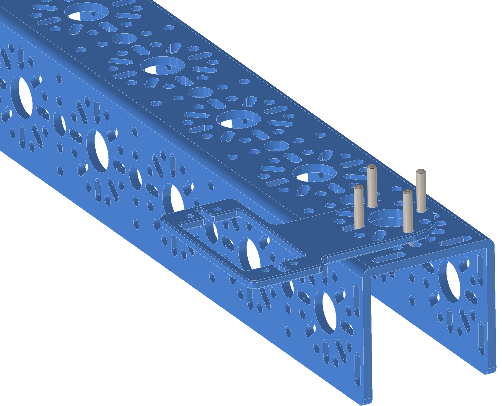
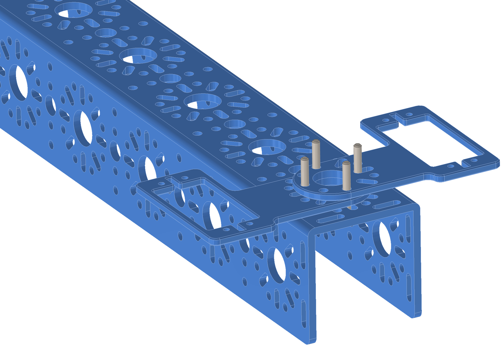
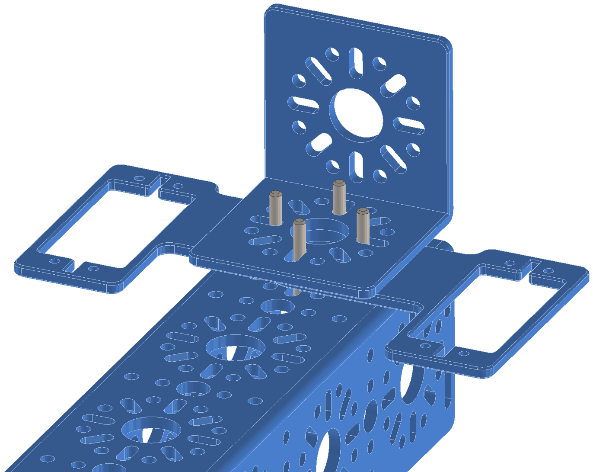
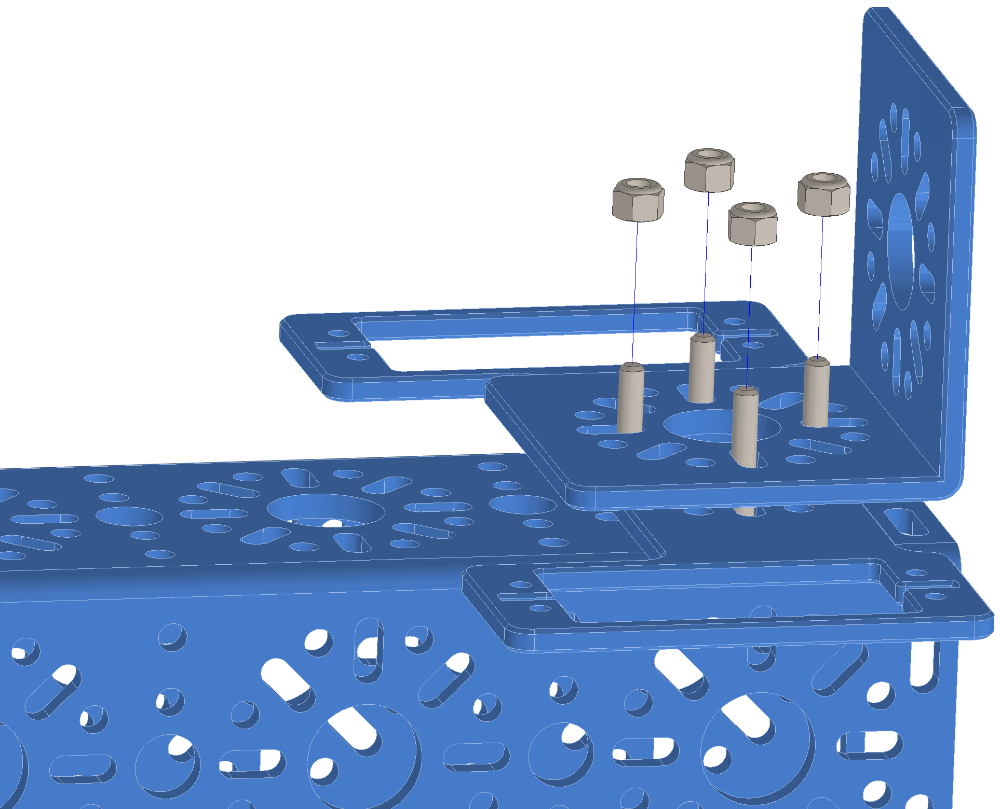

Step 12:
========

.. list-table:: Parts Required for Step 12
        :widths: 50 25 25 150
        :header-rows: 1
        :align: center

        * - Name
          - Part #
          - Qty
          - Image
        * - Completed Assembly from Step 11
          - 
          - 1
          - 
        * - M3 x 20mm SHCS
          - 76209
          - 4
          - .. image:: ../Chassis/images/bom/m3-20-shcs.png
              :align: center
              :width: 10%
        * - Servo Mount Offset Plate
          - 76146
          - 2
          - .. image:: images/bom/servo-offset-plate.png
              :align: center
              :width: 20%
        * - L Bracket
          - 76087
          - 1
          - .. image:: ../Chassis/images/bom/l-bracket.png
              :align: center
              :width: 15%
        * - M3 Nyloc
          - 76205
          - 4
          - .. image:: images/bom/m3-nyloc.png
              :align: center
              :width: 10%  

Instructions
------------

- Prep the claw mounting by inserting 4 x M3 SHCS in the holes on the end of the 384mm U-Channel.

|

- Place the Servo Offset Mounts on the M3 SHCS.

|pic1| |pic2|

|

- Place an L Bracket on top of the servo mounts.
- Screw everything down using the M3 SHCS and 4 x Nyloc nuts.

|pic3| |pic4|

