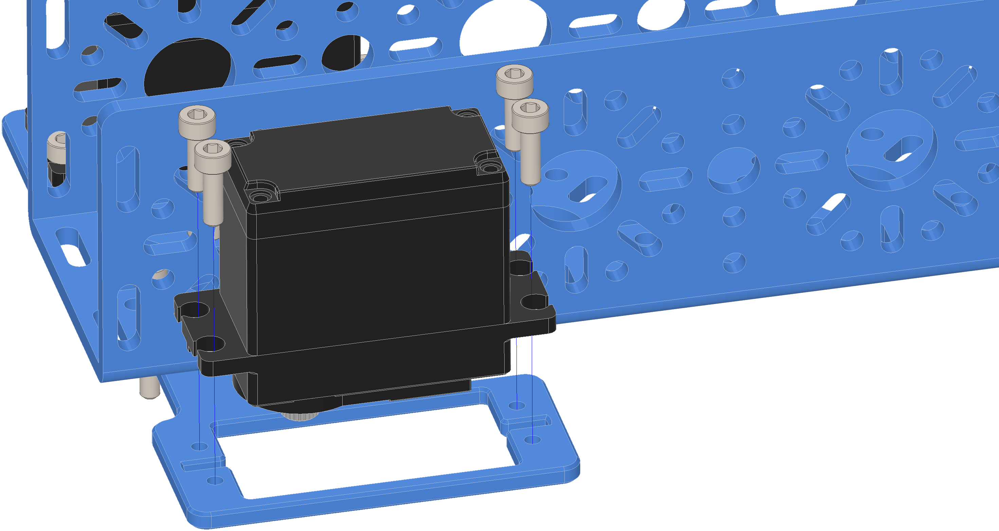

Step 13:
========

.. list-table:: Parts Required for Step 13
        :widths: 50 25 25 150
        :header-rows: 1
        :align: center

        * - Name
          - Part #
          - Qty
          - Image
        * - Completed Assembly from Step 12
          - 
          - 1
          - 
        * - M3 x 10mm SHCS
          - 76201
          - 8
          - .. image:: ../Chassis/images/bom/m3-10-shcs.png
              :align: center
              :width: 10%
        * - Smart Servo Torque
          - 75002
          - 2
          - .. image:: images/bom/multi-mode-servo.png
              :align: center
              :width: 20%

Instructions
------------

- Screw the 2 servos into their mounting plates using M3 SHCS. The spline of the servo should be facing the end of the 384mm U-Channel.

