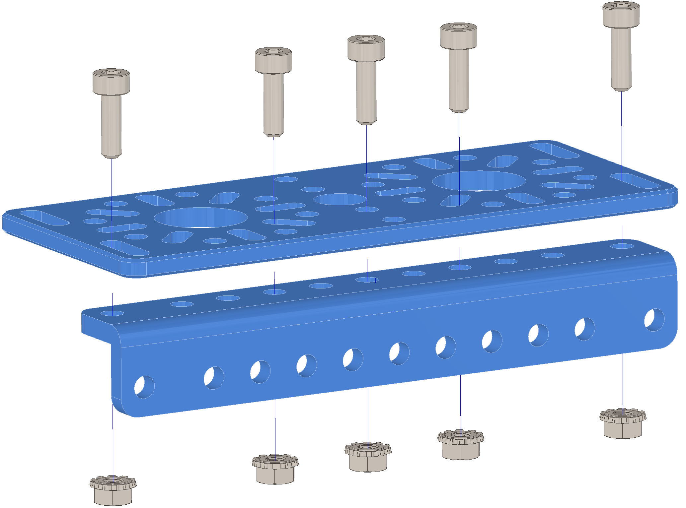

Step 14:
========

.. list-table:: Parts Required for Step 14
        :widths: 50 25 25 150
        :header-rows: 1
        :align: center

        * - Name
          - Part #
          - Qty
          - Image
        * - 96mm L Beam
          - 76117
          - 2
          - .. image:: images/bom/l-beam.png
              :align: center
              :width: 20%
        * - M3 x 10mm SHCS
          - 76201
          - 10
          - .. image:: ../Chassis/images/bom/m3-10-shcs.png
              :align: center
              :width: 10%
        * - 96mm x 40mm Flat Bracket
          - 76065
          - 2
          - .. image:: images/bom/96mm-flat.png
              :align: center
              :width: 20%
        * - M3 Kep Nut
          - 76204
          - 10
          - .. image:: ../Chassis/images/bom/m3-kep-nut.png
              :align: center
              :width: 10%

Instructions
------------

- Using 5 x M3 SHCS and 5 x Kep Nuts, assemble the claw finger as shown. 
- Repeat for the other finger. There should be two claw fingers. 

