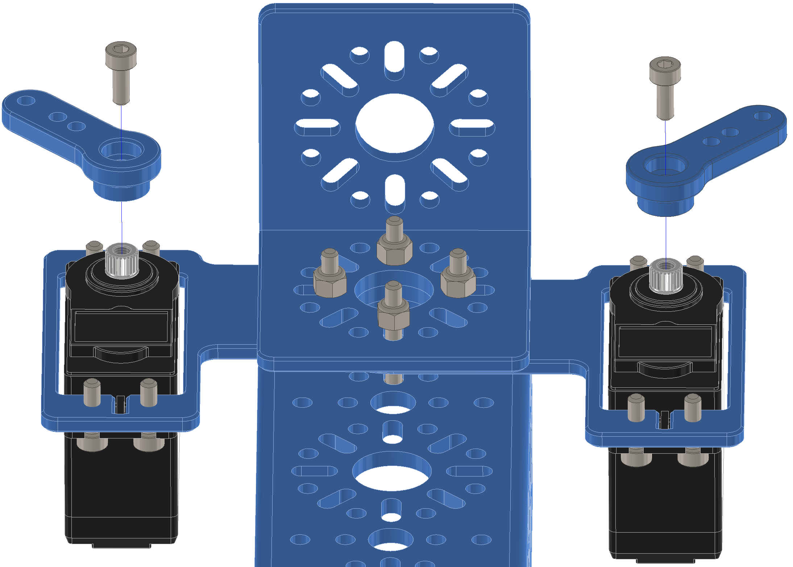

Step 15:
========

.. list-table:: Parts Required for Step 15
        :widths: 50 25 25 150
        :header-rows: 1
        :align: center

        * - Name
          - Part #
          - Qty
          - Image
        * - Completed Assembly from Step 13
          - 
          - 1
          - 
        * - M3 x 8mm SHCS
          - 76200
          - 2
          - .. image:: ../Chassis/images/bom/m3-10-shcs.png
              :align: center
              :width: 10%
        * - Servo Arm
          - 76151
          - 2
          - .. image:: images/bom/servo-arm.png
              :align: center
              :width: 15% 

Instructions
------------

- Using 2 x M3 SHCS, screw the servo arms into the servo splines.

