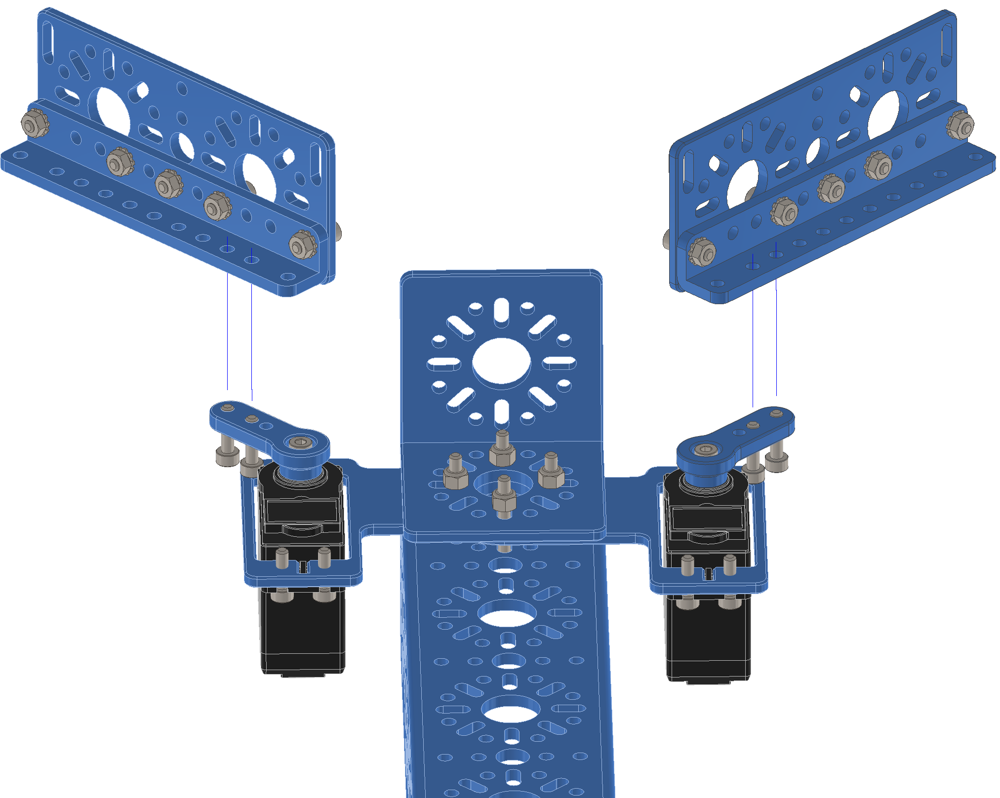
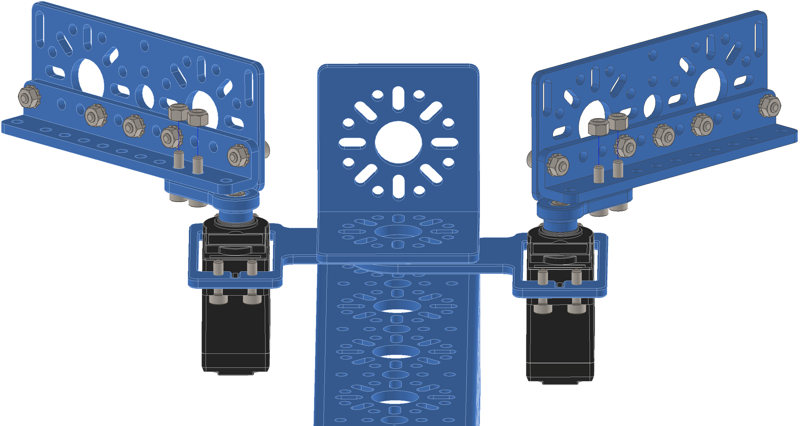
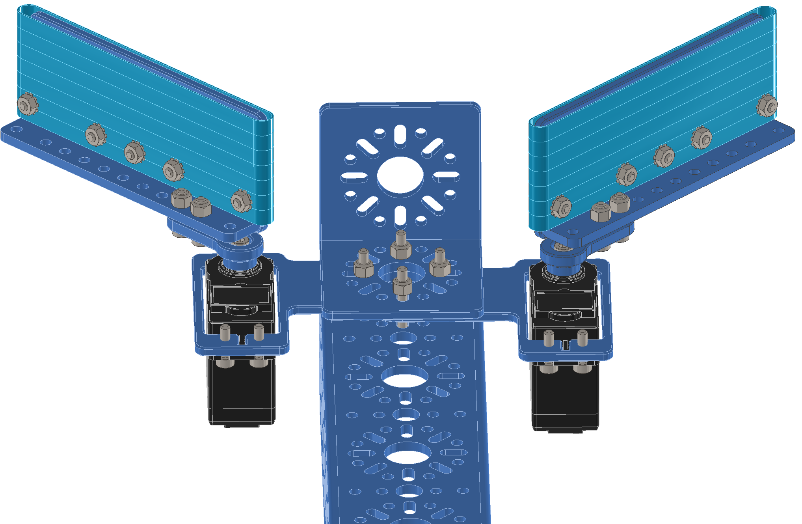

Step 16:
========

.. list-table:: Parts Required for Step 16
        :widths: 50 25 25 150
        :header-rows: 1
        :align: center

        * - Name
          - Part #
          - Qty
          - Image
        * - Completed Assembly from Step 14
          - 
          - 2
          - 
        * - Completed Assembly from Step 15
          - 
          - 1
          - 
        * - M3 x 12mm SHCS
          - 76202
          - 4
          - .. image:: ../Chassis/images/bom/m3-12-shcs.png
              :align: center
              :width: 10%
        * - M3 Nyloc
          - 76205
          - 4
          - .. image:: images/bom/m3-nyloc.png
              :align: center
              :width: 10%   

Instructions
------------

- Using 2 x M3 SHCS and 2 x M3 Nyloc nuts, screw the claw fingers onto the servo arms.

|pic1| |pic2|

Optional
--------

Rubber bands can be added around the fingers to grip an object better. 

