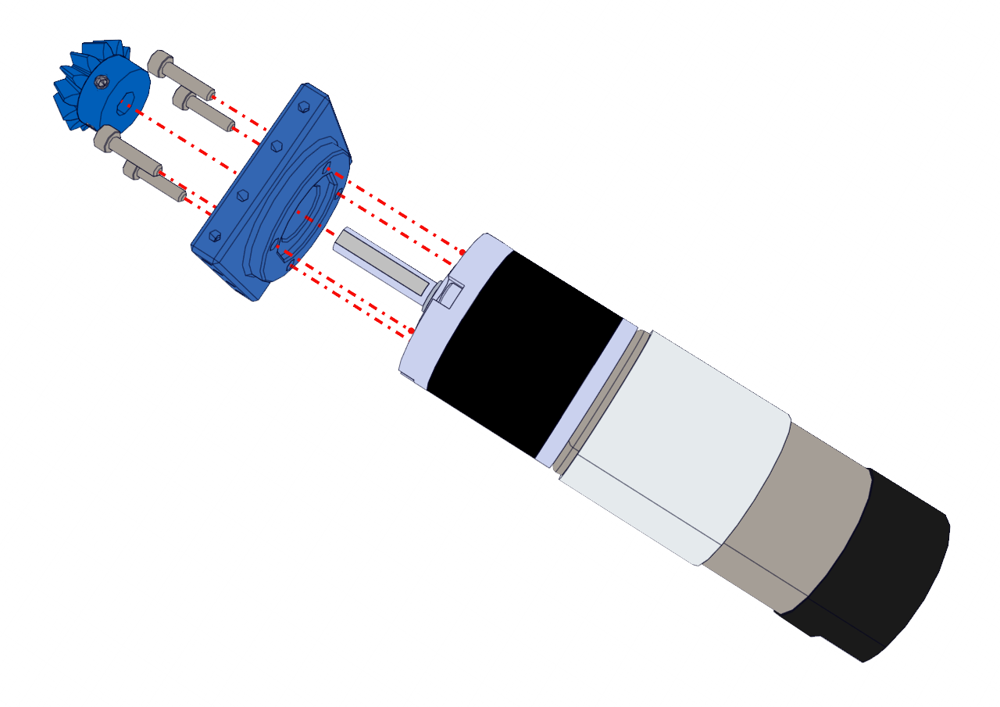
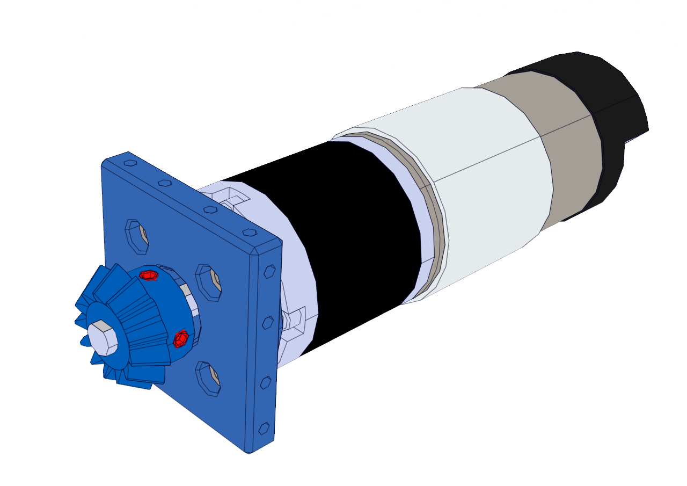

Step 3:
=======

.. list-table:: Parts Required for Step 3
        :widths: 50 25 25 150
        :header-rows: 1
        :align: center

        * - Name
          - Part #
          - Qty
          - Image
        * - NeveRest 51
          - am-4609b
          - 1
          - .. image:: images/bom/neverest-51.png
              :align: center
              :width: 40%
        * - Orbital Motor Mount
          - 76138
          - 1
          - .. image:: images/bom/orbital-motor-mount.png
              :align: center
              :width: 20%
        * - 13 Tooth Bevel Gear
          - 76223
          - 1
          - .. image:: images/bom/13-tooth-bevel.png
              :align: center
              :width: 15%
        * - M3 x 12mm SHCS
          - 76202
          - 4
          - .. image:: ../Chassis/images/bom/m3-12-shcs.png
              :align: center
              :width: 10%

Instructions
------------

- Slide the Orbital Motor Mount onto the NeveRest 51 Motor.
- Using 4 x M3 SHCS screw the motor mount into the motor.
- Slide the 13 Tooth Bevel Gear onto the D-Shaft of the motor.

- Try to keep it loose by only tightening a little bit. Set screws highlighted in red, use the pink hex key(2mm) to tighten.

