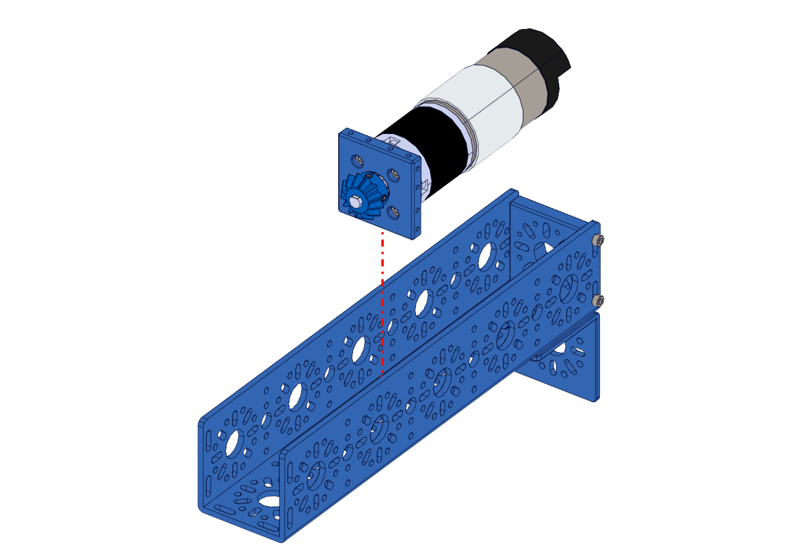

Step 4:
=======

.. list-table:: Parts Required for Step 4
        :widths: 50 25 25 150
        :header-rows: 1
        :align: center

        * - Name
          - Part #
          - Qty
          - Image
        * - Completed Assembly from Part 2
          - 
          - 1
          - 
        * - Completed Assembly from Part 3
          - 
          - 1
          - 
        * - M3 x 10mm SHCS
          - 76201
          - 6
          - .. image:: ../Chassis/images/bom/m3-10-shcs.png
              :align: center
              :width: 10%

Instructions
------------

- Slide the Motor Assembly from step 3 into the 240mm U-Channel assembly. The bevel gear should be facing away from the End Piece Plate and L Bracket.
  

|

- Using 6 x M3 SHCS, screw the Orbital Motor Mount to the 240mm U-Channel.

|pic1| |pic2|

.. |pic1| image:: images/BasicBot6.png
    :width: 40%

.. |pic2| image:: images/BasicBot7.png
    :width: 40%