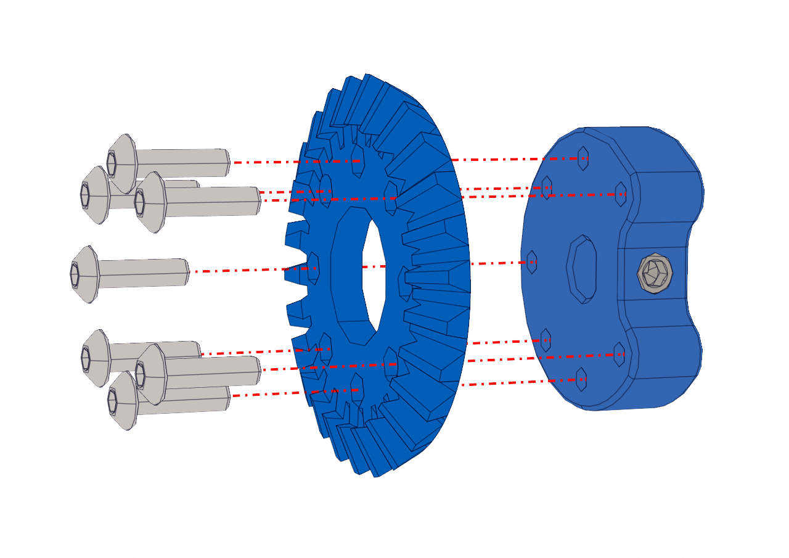

Step 5: 
=======

.. list-table:: Parts Required for Step 5
        :widths: 50 25 25 150
        :header-rows: 1
        :align: center

        * - Name
          - Part #
          - Qty
          - Image
        * - M3 x 10mm BHCS
          - 76203
          - 7
          - .. image:: ../Chassis/images/bom/m3-10-bhcs.png
              :align: center
              :width: 10%
        * - 26 Tooth Bevel Gear
          - 76224
          - 1
          - .. image:: images/bom/26-tooth-bevel.png
              :align: center
              :width: 20%
        * - Lightweight Shaft Hub
          - 76282
          - 1
          - .. image:: ../Chassis/images/bom/light-hub.png
              :align: center
              :width: 15%

Instructions
------------

- Using 7 x M3 BHCS, screw the 26 Toot Bevel Gear into the Lightweight Shaft Hub.
  
