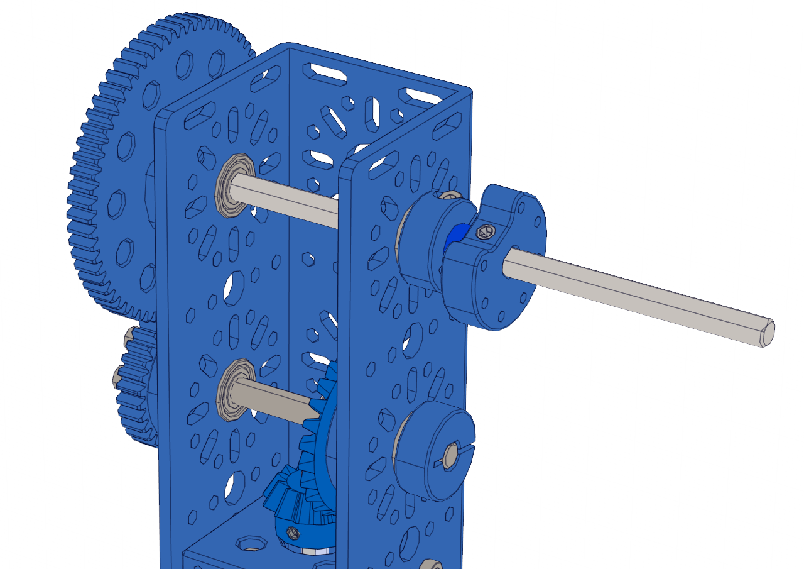

Step 8:
=======

.. list-table:: Parts Required for Step 8
        :widths: 50 25 25 150
        :header-rows: 1
        :align: center

        * - Name
          - Part #
          - Qty
          - Image
        * - Completed Assembly from Part 4
          - 
          - 1
          - 
        * - Completed Assembly from Part 5
          - 
          - 1
          - 
        * - Completed Assembly from Part 6
          - 
          - 1
          - 
        * - Completed Assembly from Part 7
          - 
          - 1
          - 
        * - 14mm Flange Bearing
          - 76302
          - 4
          - .. image:: ../Chassis/images/bom/14-bearing.png
              :align: center
              :width: 10%
        * - 1mm Shaft Spacer
          - 76305
          - 4
          - .. image:: images/bom/1mm-spacer.png
              :align: center
              :width: 10%
        * - 5mm Shaft Spacer
          - 76307
          - 1
          - .. image:: images/bom/5mm-spacer.png
              :align: center
              :width: 10%
        * - 6mm x 70mm D-Shaft
          - 76160
          - 1
          - .. image:: images/bom/70mm-dshaft.png
              :align: center
              :width: 30%
        * - 6mm x 140mm D-Shaft
          - 76164
          - 1
          - .. image:: images/bom/140mm-dshaft.png
              :align: center
              :width: 30%
        * - Collar Clamp
          - 76320
          - 2
          - .. image:: ../Chassis/images/bom/collar-clamp.png
              :align: center
              :width: 15%
        * - Lightweight Shaft Hub
          - 76282
          - 1
          - .. image:: ../Chassis/images/bom/light-hub.png
              :align: center
              :width: 15%
        
Instructions
------------

- Assemble all the assemblies as shown. 
- Tighten the set screws and collar clamps fully **EXCEPT FOR THE SET SCREW WITH THE 26 TOOTH BEVEL GEAR**.

.. figure:: images/BasicBot11.png
      :align: center
      :width: 50%

|

|pic1| |pic2|

.. |pic1| image:: images/BasicBot12.png
    :width: 40%

- With the assembly complete, as shown above, align the bevel gears so they are meshing and tighten the setscrews. 