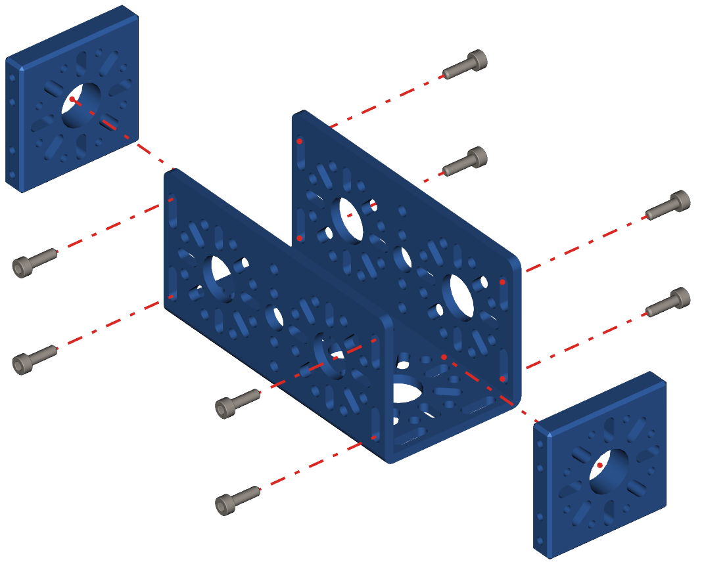

Step 1 - Start Build
====================

.. list-table:: Parts Required for Step 1
        :widths: 50 25 25 150
        :header-rows: 1
        :align: center

        * - Name
          - Part #
          - Qty
          - Image
        * - 96mm U-Channel
          - 76017
          - 2
          - .. image:: ../../Basic-Bot/Chassis/images/bom/96-u-channel.png
              :align: center
              :width: 20%
        * - End Piece Plate
          - 76015
          - 4
          - .. image:: ../../Basic-Bot/Chassis/images/bom/end-plate.png
              :align: center
              :width: 20%
        * - M3 x 10mm SHCS
          - 76201
          - 16
          - .. image:: ../../Basic-Bot/Chassis/images/bom/m3-10-shcs.png
              :align: center
              :width: 15%

Instructions
------------

- Slide the End Piece Plate into the end of the 96mm U-Channel.
- Using an M3 x 10mm SHCS screw from the outside of the 96mm U-Channel into the tapped holes of the End Piece Plates.
- Repeat for the other side.
- The End Piece Plate should sit flush on both ends of the channel.
- **Once one channel is complete, repeat the process with the other 96mm U-Channel and two other End Piece Plates.**

