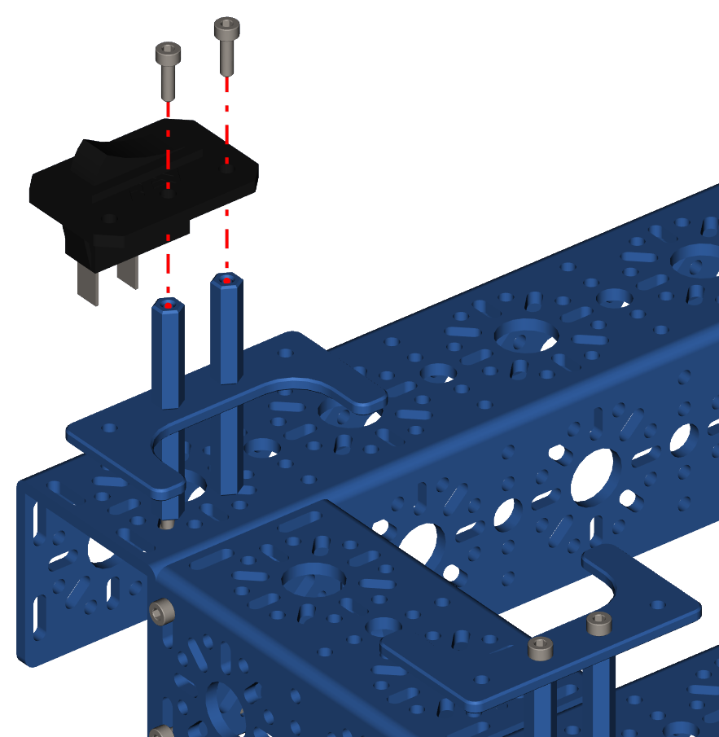

Step 12 - Power Switch
======================

.. list-table:: Parts Required for Step 12
        :widths: 50 25 25 150
        :header-rows: 1
        :align: center

        * - Name
          - Part #
          - Qty
          - Image
        * - Completed Assembly from Part 11
          - 
          - 1
          - 
        * - M3 x 10mm SHCS
          - 76201
          - 2
          - .. image:: ../../Basic-Bot/Chassis/images/bom/m3-10-shcs.png
              :align: center
              :width: 10%
        * - Power Switch
          - REV-31-1387
          - 1
          - .. image:: ../../Basic-Bot/Chassis/images/bom/power-switch.png
              :align: center
              :width: 10%

Instructions
------------

- Screw the Power switch into the 2 standoffs using 2 M3 x 10mm SHCS.

