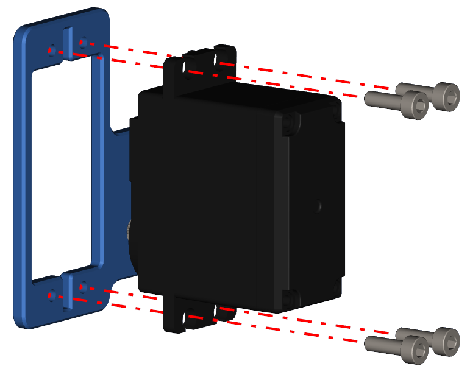
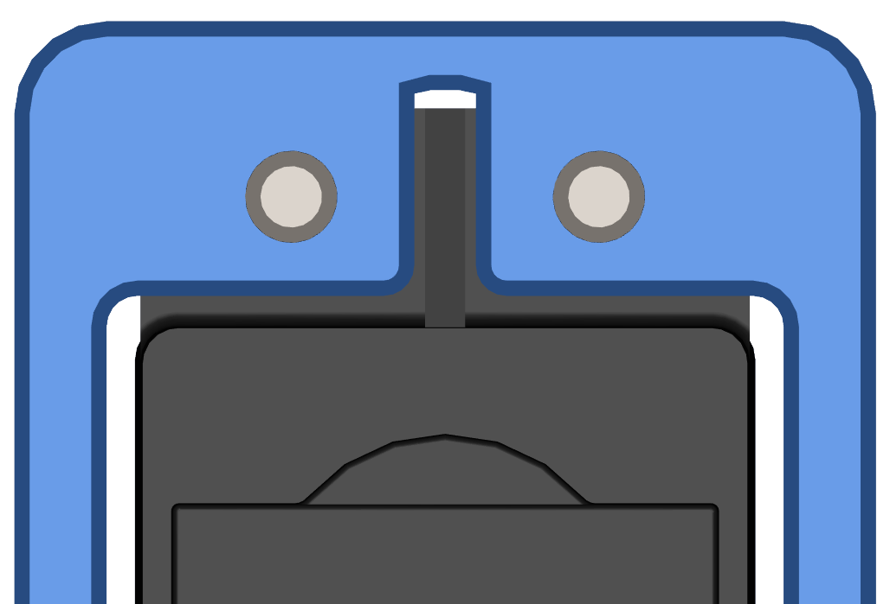

Step 13 - Servo Part 1
======================

.. list-table:: Parts Required for Step 13
        :widths: 50 25 25 150
        :header-rows: 1
        :align: center

        * - Name
          - Part #
          - Qty
          - Image
        * - M3 x 10mm SHCS
          - 76201
          - 2
          - .. image:: ../../Basic-Bot/Chassis/images/bom/m3-10-shcs.png
              :align: center
              :width: 10%
        * - Servo Mount Offset Plate
          - 76146
          - 1
          - .. image:: ../../Basic-Bot/Chassis/images/bom/offset-plate.png
              :align: center
              :width: 20%
        * - Multi-Mode Smart Servo
          - 75002
          - 1
          - .. image:: ../../Basic-Bot/Chassis/images/bom/multi-mode-smart-servo.png
              :align: center
              :width: 15%

Instructions
------------

- Screw the Servo into the offset plate using 4 M3 x 10mm SHCS.
- The Servo spline should be in line with the 14mm hole from the offset plate.
- Make sure the servo tab fits in the middle of the tab slot on the offset plate.

|pic1| |pic2|

