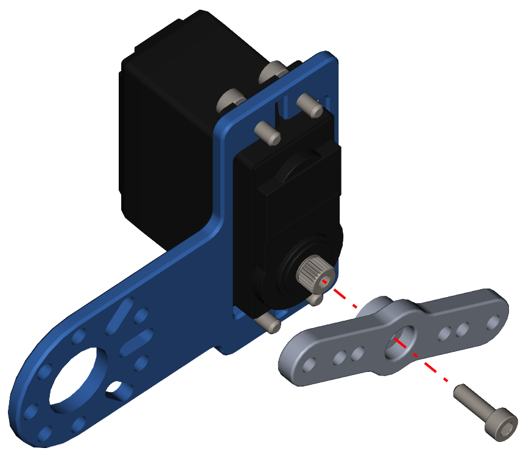

Step 14 - Servo Part 2
======================

.. list-table:: Parts Required for Step 14
        :widths: 50 25 25 150
        :header-rows: 1
        :align: center

        * - Name
          - Part #
          - Qty
          - Image
        * - Completed Assembly from Part 13
          - 
          - 1
          - 
        * - M3 x 8mm SHCS (in the bag)
          - 75002
          - 1
          - .. image:: ../../Basic-Bot/Chassis/images/bom/m3-10-shcs.png
              :align: center
              :width: 10%
        * - Servo Arm
          - 76151
          - 1
          - .. image:: ../../Basic-Bot/Chassis/images/bom/servo-arm.png
              :align: center
              :width: 20%

Instructions
------------

- Screw the servo arm into the servo spline using an M3 x 8mm SHCS included with the servo.

.. note:: The picture below shows the double servo arm, but the single servo arm is included in the kit. There is no difference for the camp bot application. 

