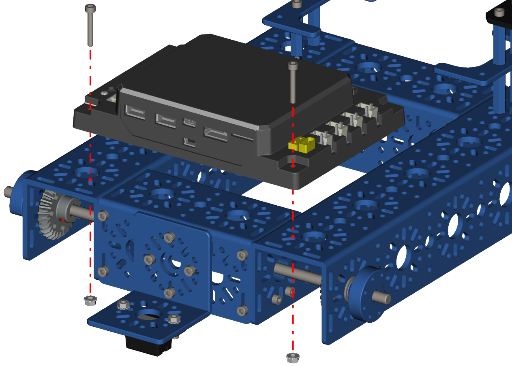

Step 16 - Control Hub Install
=============================

.. list-table:: Parts Required for Step 16
        :widths: 50 25 25 150
        :header-rows: 1
        :align: center

        * - Name
          - Part #
          - Qty
          - Image
        * - Completed Assembly from Part 15
          - 
          - 1
          - 
        * - M3 x 20mm SHCS
          - 76209
          - 2
          - .. image:: ../../Basic-Bot/Chassis/images/bom/m3-20-shcs.png
              :align: center
              :width: 10%
        * - M3 Kep Nut
          - 76204
          - 2
          - .. image:: ../../Basic-Bot/Chassis/images/bom/m3-kep-nut.png
              :align: center
              :width: 10%
        * - Control Hub
          - REV-31-1595
          - 1
          - .. image:: ../../Basic-Bot/Chassis/images/bom/control-hub.png
              :align: center
              :width: 30%

Instructions
------------

- Place the Control Hub with the HDMI and USB ports facing the drive axles and away from the battery clips. 
- Using the M3 x 20mm SHCS and M3 Kep Nuts, secure the Control Hub to the frame, as shown in the picture.

