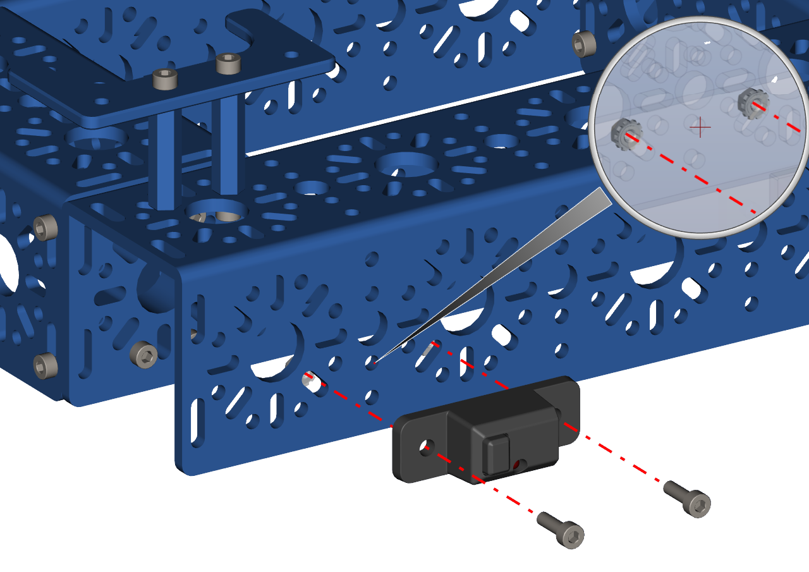

Step 17 - Touch Sensor
======================

.. list-table:: Parts Required for Step 17
        :widths: 50 25 25 150
        :header-rows: 1
        :align: center

        * - Name
          - Part #
          - Qty
          - Image
        * - Completed Assembly from Part 16
          - 
          - 1
          - 
        * - M3 x 10mm SHCS
          - 76201
          - 2
          - .. image:: ../../Basic-Bot/Chassis/images/bom/m3-10-shcs.png
              :align: center
              :width: 10%
        * - M3 Kep Nut
          - 76204
          - 2
          - .. image:: ../../Basic-Bot/Chassis/images/bom/m3-kep-nut.png
              :align: center
              :width: 10%
        * - Touch Sensor
          - REV-31-1425
          - 1
          - .. image:: ../../Basic-Bot/Chassis/images/bom/touch-sensor.png
              :align: center
              :width: 15%

Instructions
------------

- On the back right side of the frame (battery clip side without power switch), install the touch sensor as shown.

