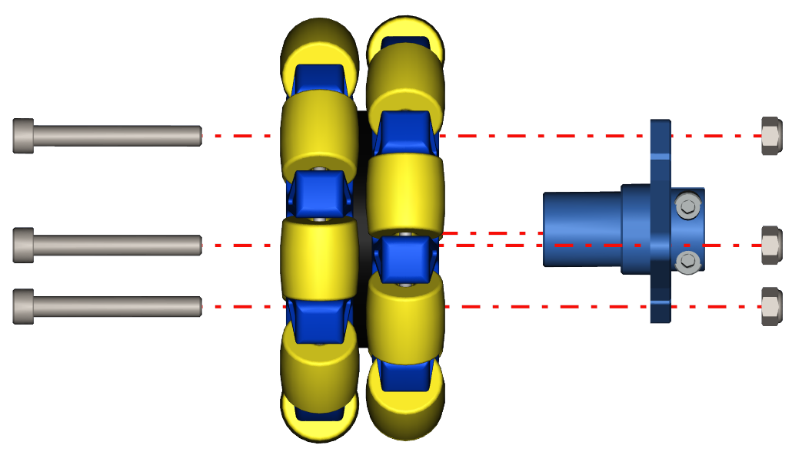

Step 18 - Omni Wheel Part 1
===========================

.. important:: This step requires pliers or an 8mm wrench.

.. list-table:: Parts Required for Step 18
        :widths: 50 25 25 150
        :header-rows: 1
        :align: center

        * - Name
          - Part #
          - Qty
          - Image
        * - 100mm Omni Wheel
          - 76260
          - 1
          - .. image:: ../../Basic-Bot/Chassis/images/bom/omni-wheel.png
              :align: center
              :width: 15%
        * - Enhanced Wheel Hub Kit
          - 76291
          - 1
          - .. image:: ../../Basic-Bot/Chassis/images/bom/enhanced-hub.png
              :align: center
              :width: 15%

Instructions
------------

- Using 3 of the M5 x 40mm SHCS, screw the Omni Wheel into the Enhanced Wheel Hub with the M5 Nyloc nuts on the other side of the Hub.
- The Nyloc nuts will need to be secured with pliers or an 8mm wrench. Otherwise, they will spin in place.
- Pre-install the M4 x 8mm SHCS into the Enhanced Wheel Hub. **DO Not Tighten the M4 Screws**
- Repeat for the other side.

