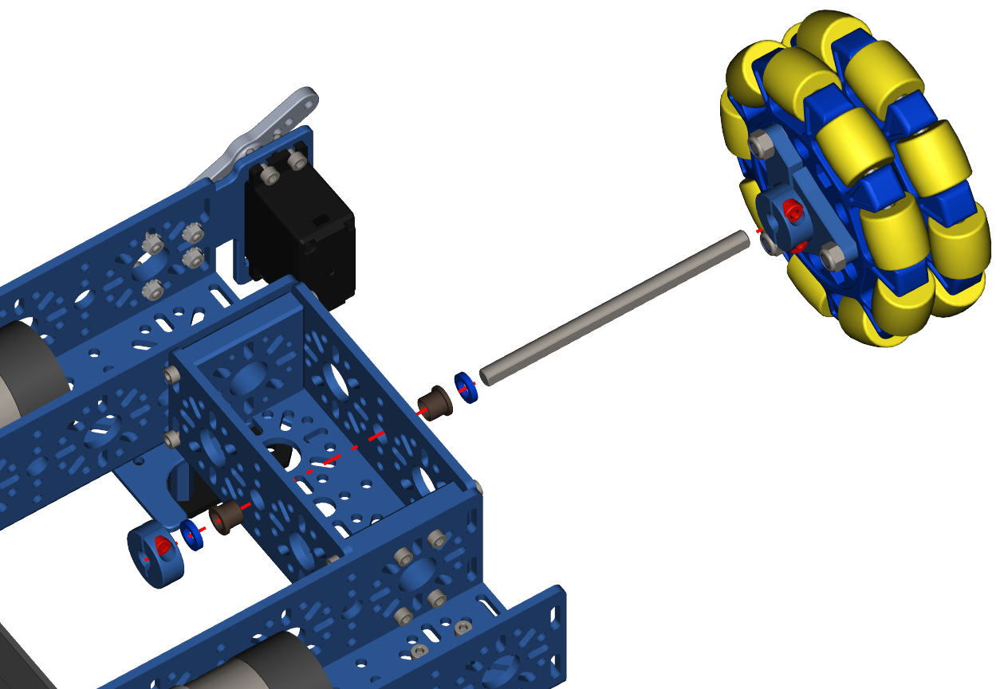
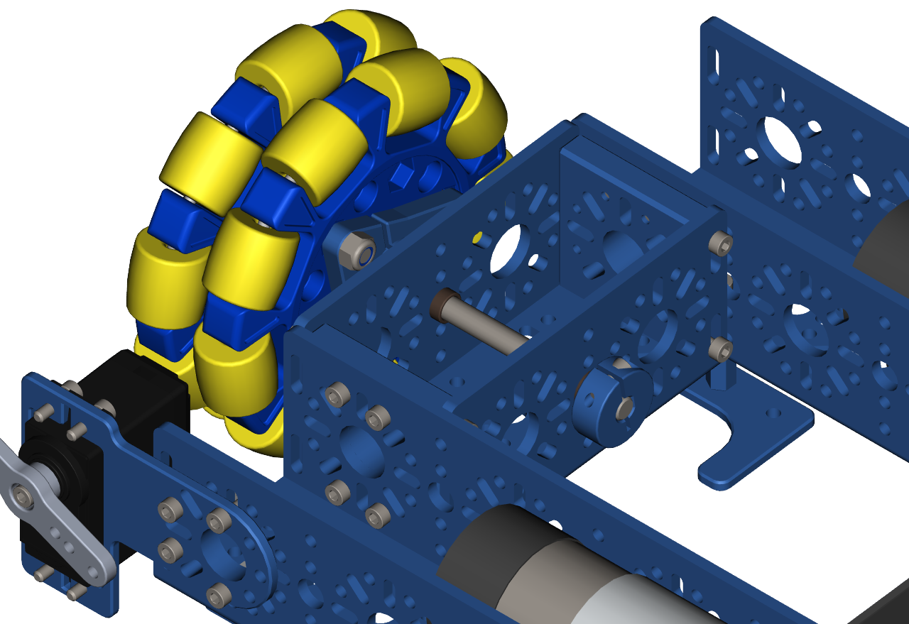

Step 19 - Omni Wheel Part 2
===========================

.. list-table:: Parts Required for Step 19
        :widths: 50 25 25 150
        :header-rows: 1
        :align: center

        * - Name
          - Part #
          - Qty
          - Image
        * - Completed Assembly from Part 17
          - 
          - 1
          - 
        * - Completed Assembly from Part 18
          - 
          - 1
          - 
        * - Bronze Bushing 6mm ID x 8mm OD
          - 76300
          - 2
          - .. image:: ../../Basic-Bot/Chassis/images/bom/8mm-bushing.png
              :align: center
              :width: 10%
        * - Collar Clamp
          - 76320
          - 1
          - .. image:: ../../Basic-Bot/Chassis/images/bom/collar-clamp.png
              :align: center
              :width: 10%
        * - 2mm Shaft Spacer
          - 76306
          - 2
          - .. image:: ../../Basic-Bot/Chassis/images/bom/2-spacer.png
              :align: center
              :width: 10%
        * - 6mm x 96mm D-Shaft
          - 76161
          - 1
          - .. image:: ../../Basic-Bot/Chassis/images/bom/96-d-shaft.png
              :align: center
              :width: 40%

Instructions
------------

- Place the Collar Clamp on the edge of the 6mm D-Shaft and fully tighten the M3 screw down to clamp the Collar Clamp to the D-Shaft. **Take note to ensure the Collar Clamp and Shaft are flush at one end**
- Slide a 2mm Spacer from the other end of the shaft down to the Collar Clamp.
- Slide the Bushing from the other end of the shaft down to the spacer. **The Flange of the bushing should be touching the spacer**
- Slide the Shaft into the 8mm hole in the middle of the 96mm U-Channel from the inside of the frame.
- Slide a Bushing from the outside of the 96mm U-Channel onto the shaft. **The Flange of the bushing should be facing outside**
- Slide a 2mm spacer on the shaft so that it makes contact with the bushing. 
- Slide the Enhanced Wheel Hub onto the shaft and clamp it down using the 3mm Hex Key (Blue).
- The finished assembly should look like the picture on the right. 
- Check to ensure you can spin the Enhanced Wheel hub without any issues. If there are issues, loosen the hub or the collar clamp and try again. The hub should be able to spin smoothly. 

|pic1| |pic2|

