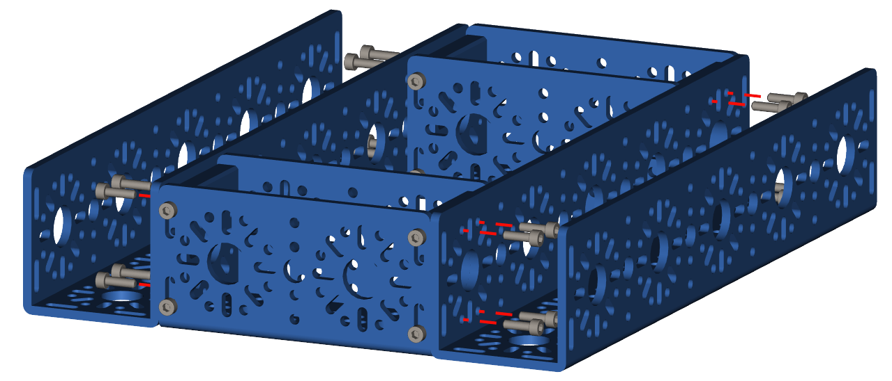

Step 2 - Frame Assembly
=======================

.. list-table:: Parts Required for Step 2
        :widths: 50 25 25 150
        :header-rows: 1
        :align: center

        * - Name
          - Part #
          - Qty
          - Image
        * - Completed Assembly from Part 1
          - 
          - 2
          - 
        * - 240mm U-Channel
          - 76014
          - 2
          - .. image:: ../../Basic-Bot/Chassis/images/bom/240-u-channel.png
              :align: center
              :width: 40%
        * - M3 x 10mm SHCS
          - 76201
          - 16
          - .. image:: ../../Basic-Bot/Chassis/images/bom/m3-10-shcs.png
              :align: center
              :width: 15%

Instructions
------------

- Align the 96mm U-Channel with the 240mm U-Channel as shown below.
- Using M3 x 10mm SHCS, screw the 240mm U-Channel into the End Piece Blocks on the 96mm U-Channel. **Do not fully tighten the screws**
- Once all 16 screws have been put in, square up the frame so that everything is straight and level. 
- Fully tighten all screws using a star pattern. 

.. note:: NEED TO ADD AN IMAGE HERE SHOWING THE HEX KEY GOING THROUGH THE CHANNEL

