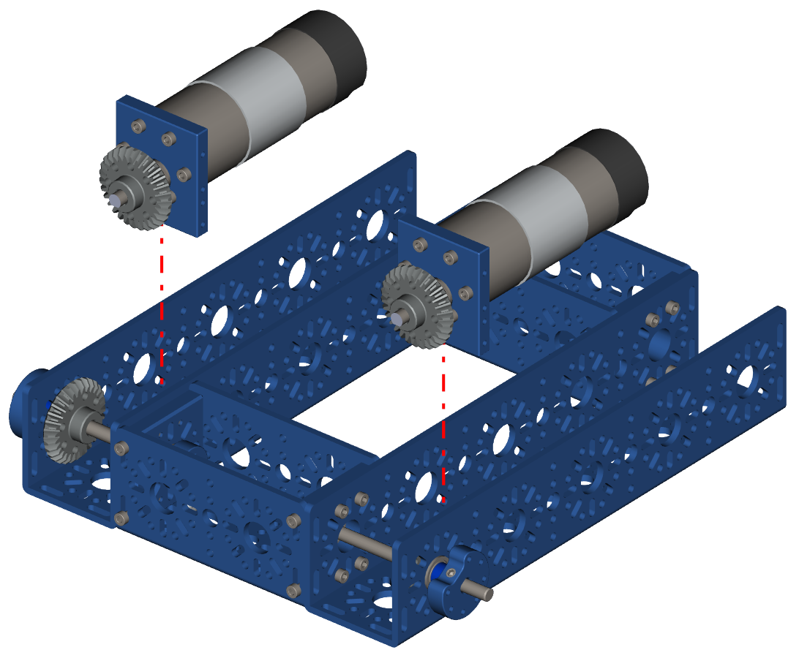
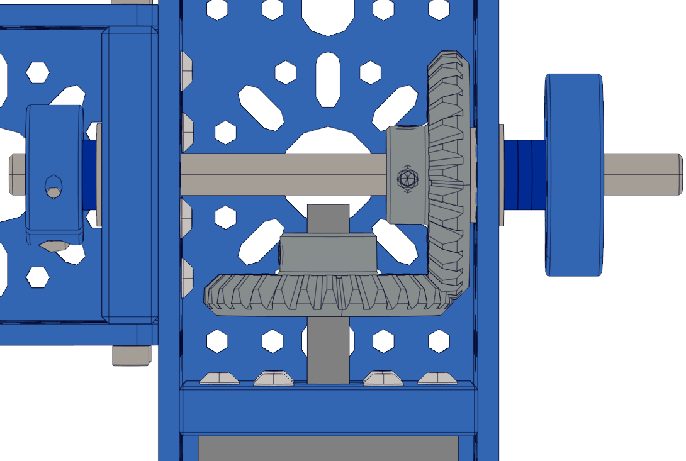

Step 5 - Inserting Motors 
=========================

.. list-table:: Parts Required for Step 6
        :widths: 50 25 25 150
        :header-rows: 1
        :align: center

        * - Name
          - Part #
          - Qty
          - Image
        * - Completed Assembly from Part 3
          - 
          - 1
          - 
        * - Completed Assembly from Part 4
          - 
          - 2
          - 

Instructions
------------

- Slide the Motor Assemblies down into the chassis as shown in the pictures below. 

|pic1| |pic2|

