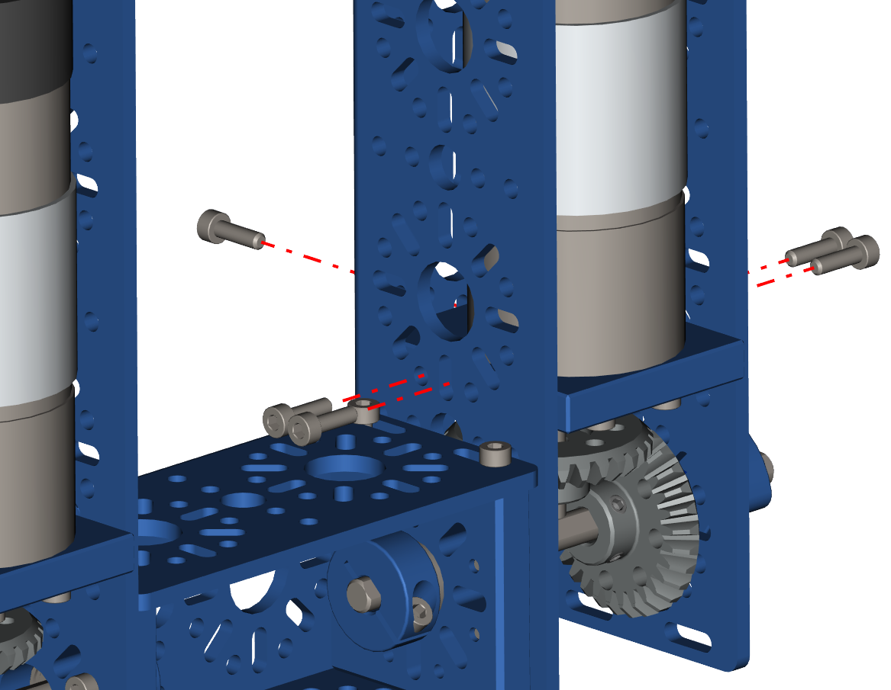
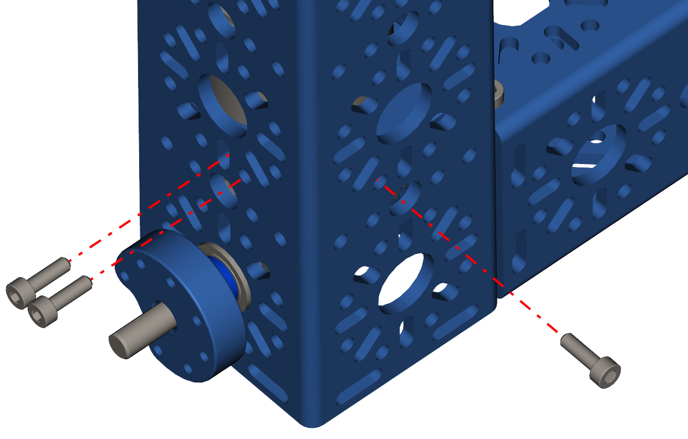

Step 6 - Securing the Motor Bracket
===================================

.. list-table:: Parts Required for Step 6
        :widths: 50 25 25 150
        :header-rows: 1
        :align: center

        * - Name
          - Part #
          - Qty
          - Image
        * - Completed Assembly from Part 7
          - 
          - 1
          - 
        * - M3 x 10mm SHCS
          - 76201
          - 10
          - .. image:: ../../Basic-Bot/Chassis/images/bom/m3-10-shcs.png
              :align: center
              :width: 10%

Instructions
------------

- Using the M3 x 10mm SHCS screw in the 5 screw points as shown in the pictures below.
- Repeat the process for the other side.  

|pic1| |pic2|

