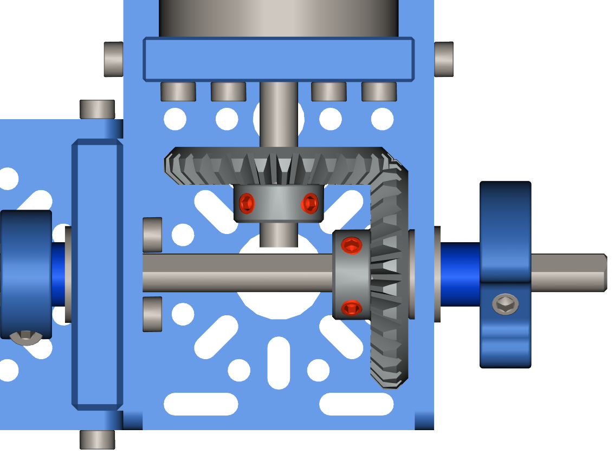

Step 7 - Bevel Gear Alignment
=============================

.. list-table:: Parts Required for Step 7
        :widths: 50 25 25 150
        :header-rows: 1
        :align: center

        * - Name
          - Part #
          - Qty
          - Image
        * - Completed Assembly from Part 6
          - 
          - 1
          - 

Instructions
------------

- Mesh the two bevel gears and tighten the setscrews. **You may need to do one rotate the shaft and repeat to get all 4.**
- Repeat the process for the other side.  

