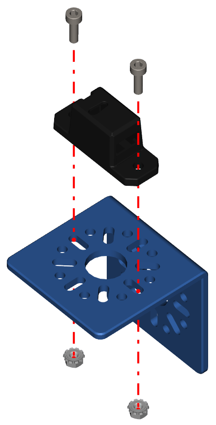

Step 8 - Colour Sensor Part 1
=============================

.. list-table:: Parts Required for Step 8
        :widths: 50 25 25 150
        :header-rows: 1
        :align: center

        * - Name
          - Part #
          - Qty
          - Image
        * - M3 x 10mm SHCS
          - 76201
          - 2
          - .. image:: ../../Basic-Bot/Chassis/images/bom/m3-10-shcs.png
              :align: center
              :width: 10%
        * - Colour Sensor
          - REV-31-1557
          - 1
          - .. image:: ../../Basic-Bot/Chassis/images/bom/colour-sensor.png
              :align: center
              :width: 15%
        * - M3 Kep Nut
          - 76204
          - 2
          - .. image:: ../../Basic-Bot/Chassis/images/bom/m3-kep-nut.png
              :align: center
              :width: 10%
        * - L Bracket
          - 76087
          - 1
          - .. image:: ../../Basic-Bot/Chassis/images/bom/l-bracket.png
              :align: center
              :width: 20%

Instructions
------------

- Using M3 x 10mm SHCS and Kep Nuts, attach the Colour sensor to an L Bracket.

