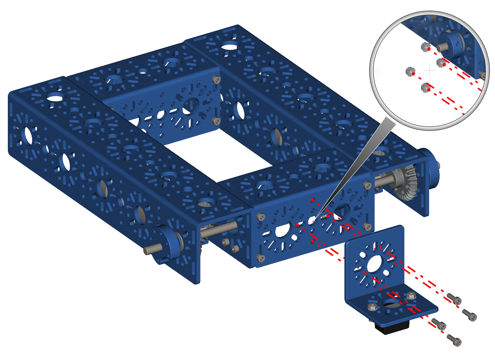

Step 9 - Colour Sensor Part 2
=============================

.. list-table:: Parts Required for Step 8
        :widths: 50 25 25 150
        :header-rows: 1
        :align: center

        * - Name
          - Part #
          - Qty
          - Image
        * - Completed Assembly from Part 7
          - 
          - 1
          - 
        * - Completed Assembly from Part 8
          - 
          - 1
          - 
        * - M3 x 10mm SHCS
          - 76201
          - 4
          - .. image:: ../../Basic-Bot/Chassis/images/bom/m3-10-shcs.png
              :align: center
              :width: 10%
        * - M3 Kep Nut
          - 76204
          - 4
          - .. image:: ../../Basic-Bot/Chassis/images/bom/m3-kep-nut.png
              :align: center
              :width: 10%

Instructions
------------

- Using M3 x 10mm SHCS and Kep Nuts, attach the L Bracket to the 96mm U-Channel on the drive wheel axle side.

