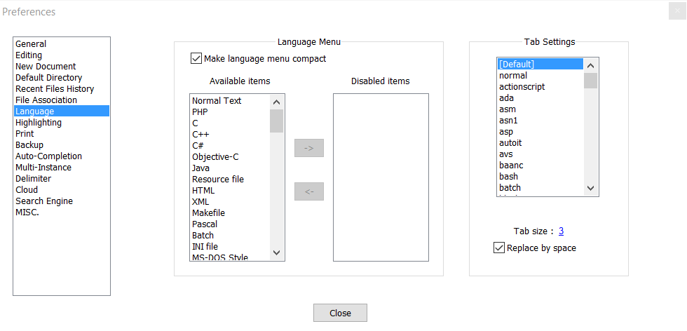

Style Guide
===========

Filenames
---------

Only lowercase alphanumeric characters, ``-`` (minus) symbol and the ``.rst`` extension should be used.

Examples:

- ``style-guide.rst``
- ``index.rst``
- ``a-super-long-filename-that-is-to-long.rst``


Preferred Editor
----------------

It is preferred to use `Notepad++ <https://notepad-plus-plus.org/>`__ as the text editor for creating files. When creating a ``.rst`` file **tabs** need to be replaced with a **space indentation** of ``3``. 

This can be accomplished easilly with Notepad++ by going to ``Settings/Preferences/Language``. In Language look to the right side for ``Tab Settings``, select ``[Default]`` then check ``Replace by space`` and set the **Tab size:** to ``3``. An example image is shown below.


   
.. important:: All text should be on the same line. To make it easier to read turn on text wrap. In Notepad++ this feature is enabled by going to ``View/Word wrap``
   
Indentation and Blank Lines
---------------------------

Indentations should **always** match the previous level of indentation unless a new content block is created.

There should always be ``1`` blank line between everything. Except for lists. 

.. code-block:: rst
   :emphasize-lines: 2,4,6
   
   .. tabs:: Example
   
      some stuff
      
      .. note:: some other stuff
      
      .. image:: images/fake-image-1.png
         :align: center

.. note:: The highlight lines are the ``1`` blank line. Also note how there is no blank line between ``.. image::`` and ``:align:`` as they are related and not seperate blocks.

Naming Conventions
------------------

To match other documentation use the following case for these terms exactly:

- roboRIO
- LabVIEW
- myRIO
- Visual Studio Code or VS Code
- macOS 
- Linux
- VMXpi
   
Images
------

Images are easy to add and give a visual aspect to the user.

.. code-block:: rst

   .. image:: images/example-image.png
   
Images should always be aligned to the center.

.. code-block:: rst

   .. image:: images/example-image.png
      :align: center
      
If an image is to big or needs to be resized options such as width can be used to scale the image. 

.. code-block:: rst

   .. image:: images/example-image.png
      :align: center
      :width: 1000

Image Files
^^^^^^^^^^^

Location
~~~~~~~~

Images should be stored in the same directory as the file using the image, located in a sub-directory ``images``. 

.. code-block:: rst
   
   docs/Contributing/style-guide <- is the file
   docs/Contributing/images/style-guide-1.png <- image location

File Types
~~~~~~~~~~

Supported image types:

- ``.png``
- ``.jpg``
- ``.gif``

.. note:: If including a ``.gif`` image a ``.png`` static version of the same name is required to be included in the ``images`` folder. This is required for a proper ``pdf`` build.

If using a ``.gif`` the format for the image would be this:

.. code-block:: rst

   .. image:: images/example-image.*
      :align: center
      
Naming Conventions
~~~~~~~~~~~~~~~~~~

Images should be named corresponding to the name of the file using it and incremented with a number enumerated to the end. Examples are shown below.

Filename ``style-guide.rst`` would have the images 

- ``style-guide-1.png``
- ``style-guide-2.png``
   
Filename ``another-example.rst`` would have the images 

- ``another-example-1.gif``
- ``another-example-1.png``

Headings
--------

Headings are signified with an underline with a specific symbol along with the heading character length.
The following are the symbol levels to create heading:

1. ``=`` used for document titles and should only be used once

.. code-block:: rst
   
   Document Title
   ==============
   
2. ``-`` signifies the chapters or sections

.. code-block:: rst
   
   Chapter or Section
   ------------------
   
3. ``^`` signifies a new sub-section

.. code-block:: rst
   
   New Sub-Section
   ^^^^^^^^^^^^^^^

4. ``~`` signifies a sub-sub-section

.. code-block:: rst
   
   Sub-Sub-Section
   ~~~~~~~~~~~~~~~
   
.. note:: If a heading more than a **sub-sub-section** is required then in most cases it should be written another way

Links
-----

Links should be formated to be anonymous hyperlinks. The format of which is shown below.

.. code-block:: rst

   `Link <https://google.com>`__ 
   
This will come out as: `Link <https://google.com>`__ 

.. note:: The anonymous link has a few sections. First the `````, then the text the link will attach to in this case ``Link``, the link itself in ``<>``, another `````, and finally at the end there are **TWO** underscores ``__``.

Code Blocks
-----------

To create a block of code, use the ``code-block`` directive. 

.. important:: Line numbers are required for any block of code that contatains code. This is shown below. An exception for not having line numbers is when the code-block is just used for unformated text.

.. code-block:: rst

   .. code-block:: (language)
      :linenos:
      
	  Source code

Here is a simple Java example.

.. code-block:: rst

   .. code-block:: java
      :linenos:
      
      System.out.println("Hello to whomever is reading this.");
      
Will come out as:

.. code-block:: java
      :linenos:
      
      System.out.println("Hello to whomever is reading this.");

To higlight certain lines to stand out the ``:emphasize-lines:`` is used.

.. code-block:: rst

   .. code-block:: java
      :linenos:
      :emphasize-lines: 2,4
      
      System.out.println("Hello to whomever is reading this.");
      System.out.println("I hope you learn something.");
      System.out.println("Its real important.");
      System.out.println("For success.");

Will come out as: 

.. code-block:: java
      :linenos:
      :emphasize-lines: 2,4
      
      System.out.println("Hello to whomever is reading this.");
      System.out.println("I hope you learn something.");
      System.out.println("Its real important.");
      System.out.println("For success.");

.. hint:: The use of ``2,3,4`` is useful for single lines but for ranges ``2-4`` would work better. They can also be joined I.E. ``2,4,6-10,12``.

Lists
-----

There are two types of lists and they are easy to use. 

.. code-block:: rst

   - This is
   - a simple
   - bullet lists
   
   1. This is 
   2. a simple
   3. numeric list

- This is
- a simple
- bullet lists
   
1. This is   
2. a simple
3. numeric list

.. note:: List's don't require the ``1`` line blank space in-between like the other functions

Tabs
----

Tabs are a useful tool with many uses.

A common use case in this documentation is Java and C++ tabs.

.. code-block:: rst
   
   .. tabs::
   
      .. tab:: Java
	     
         .. code-block:: java
            :linenos:
            
            System.out.println("Hello World!");
		 
      .. tab:: C++
		
         .. code-block:: c++
            :linenos:
            
            std::cout << "Hello World!";
            
Would come out looking like:

.. tabs::

   .. tab:: Java
	     
      .. code-block:: java
         :linenos:
            
         System.out.println("Hello World!");
		 
   .. tab:: C++
		
      .. code-block:: c++
         :linenos:
            
         std::cout << "Hello World!";

		 
For more information, vist `Sphinx tabs <https://github.com/djungelorm/sphinx-tabs>`_.

Admonitions
-----------

Admonitions are a popup to indicate a warning or important information. The following are the possible admonitions; attention, caution, danger, error, hint, important, note, tip and warning. To utilize a admonition use the keywords admonition as a directive.

For ease of use place descriptions on the same line as the admonition.

Yes

.. code-block:: rst
   
   .. attention:: Description
   
No

.. code-block:: rst

   .. attention:: 
   
      Description
      
Examples of each:

.. attention:: This is the attention admonition

.. caution:: This is the caution admonition

.. danger:: This is the danger admonition

.. error:: This is the error admonition

.. hint:: This is the hint admonition

.. important:: This is the important admonition

.. note:: This is the note admonition

.. tip:: This is the tip admonition

.. warning:: This is the warning admonition


