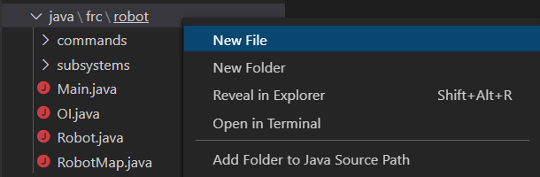
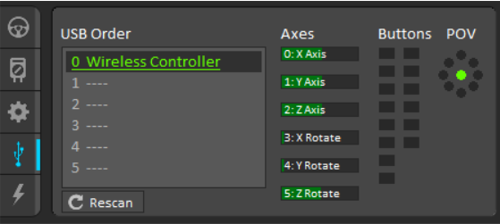
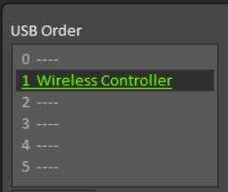
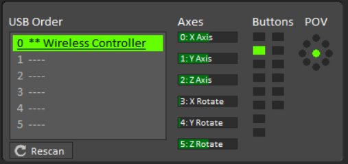
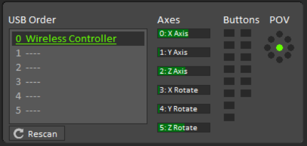
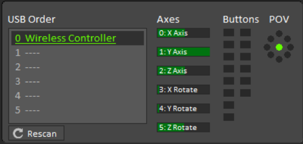

Creating a Gamepad Constants Class
==================================

To make it easier to read the inputs from a controller, we can create a class just like the RobotMap, but instead of mapping out the electrical connections of the robot, we are mapping out the controller. 

For this example, a PS4 controller will be used. 

.. note:: A PS4 controller has wireless capabilities through Bluetooth. This is illegal for use in FRC; however, the PS4 controller can be wired with a USB cable to the computer, which makes it legal. 

To create a new file right, click on ``java\frc\robot`` and chose New File. Name the file ``GamepadConstants.java``.

   
Notice how the file created is empty. Using ``RobotMap.java`` as a template, let's populate it with the basics.

.. code-block:: java
   :linenos:
   
   package frc.robot;

   /**
    * Gamepad Constants
    * 
    * Mapped out inputs from PS4 controller connected via USB Cable
    */
   public class GamepadConstants
   {

   }
   
Let's populate the GamepadConstants class with all the buttons and joysticks on the PS4 controller. We don't know what to assign the constants just yet, and we are only creating the framework. 

.. code-block:: java
   :linenos:
   
   public class GamepadConstants
   {
   
      //Controller USB Port
         public static final int DRIVE_USB_PORT       = 0;
         
      //Buttons
         public static final int X_BUTTON             = 0;
         public static final int SQUARE_BUTTON        = 0;
         public static final int CIRCLE_BUTTON        = 0;
         public static final int TIRANGLE_BUTTON      = 0;
         public static final int L1_BUTTON            = 0;
         public static final int R1_BUTTON            = 0;
         public static final int L2_BUTTON            = 0;
         public static final int R2_BUTTON            = 0;
         public static final int SHARE_BUTTON         = 0;
         public static final int OPTIONS_BUTTON       = 0;
         public static final int L3_BUTTON            = 0;
         public static final int R3_BUTTON            = 0;
         public static final int PS_LOGO_BUTTON       = 0;
         public static final int TOUCHPAD_BUTTON      = 0;
         
      //Joystick 
         public static final int LEFT_X               = 0;
         public static final int LEFY_Y               = 0;
         public static final int RIGHT_X              = 0;
         public static final int RIGHT_Y              = 0;
         
   }
   
.. note:: All assigned values are 0 as we have to determine what to put there. 

To determine the actual values to assign each constant, the ``Driver Station`` needs to be opened. 

   
On the ``USB Devices`` tab, we can see the PS4 controller on port 0 in the USB order section. The controller is named ``Wireless Controller`` as this is how Windows defines the driver used by the PS4 controller. As the controller is on port 0, we do not need to change the value of ``DRIVE_USB_PORT`` as it is already 0. If we wanted the PS4 controller on port 1, we would have to change it in GamepadConstants and drag the ``Wireless Controller`` to port 1 on the driver station. An example is shown below.

   
To map out the rest of the buttons and joysticks of the PS4 controller we need to press the button or move the joystick. For example, if I press down the ``X`` button on the controller we can see an indicator turn green on the driver station.

   
If we count which indicator turned on, we can see that the ``X`` button on the PS4 controller corresponds to the button ``2``. The numbering starts with 1 in the top left then counts down, and once it reaches the bottom, it wraps to the top right and counts down again. If we press all the buttons on the controller we can slowly map out every input. The updated button list is below. 

.. code-block:: java
   :linenos:
   
      //Controller USB Port
         public static final int DRIVE_USB_PORT       = 0;
         
      //Buttons
         public static final int X_BUTTON             = 2;
         public static final int SQUARE_BUTTON        = 1;
         public static final int CIRCLE_BUTTON        = 3;
         public static final int TIRANGLE_BUTTON      = 4;
         public static final int L1_BUTTON            = 5;
         public static final int R1_BUTTON            = 6;
         public static final int L2_BUTTON            = 7;
         public static final int R2_BUTTON            = 8;
         public static final int SHARE_BUTTON         = 9;
         public static final int OPTIONS_BUTTON       = 10;
         public static final int L3_BUTTON            = 11;
         public static final int R3_BUTTON            = 12;
         public static final int PS_LOGO_BUTTON       = 13;
         public static final int TOUCHPAD_BUTTON      = 14;
         
The only thing left is to map the joystick inputs. Joystick inputs are found under the axes subsection. As seen previously in the image above, there are six axes detected. Four of the axes are half-filled; this is due to the joysticks operating on a 16-bit signed variable. The range of a joystick is -32768 to 32767. Currently, as the joysticks are not being moved, they are responding with 0 as the value. 0 falls in the middle of the range, and thus the bar is half full. 

   
If we use the left joystick y-axis as an example, we can see from the images above that it is on port ``1`` of the axes subsection. On the left image, we move the joystick in the forward direction, yet the bar is empty. This is because, on Windows, joysticks give a negative value when going in the forward direction and positive in the reverse direction. Reverse direction is shown in the image on the right. The reversed values are because joysticks were created for controlling aircraft. When pushing down on a joystick (moving it away from you), you are tipping the aircraft down hence a negative value. When you pull up (moving it towards you), you are pulling the aircraft up, therefore positive. 

We can now map out the last remaining constants in GamepadConstants.

.. code-block:: java
   :linenos:
   
      //Joystick 
         public static final int LEFT_X               = 0;
         public static final int LEFY_Y               = 1;
         public static final int RIGHT_X              = 2;
         public static final int RIGHT_Y              = 5;
         
.. note:: The mapping seen here only applies for a PS4 Controller. A different controller will have different mappings depending on available joysticks and buttons. 
