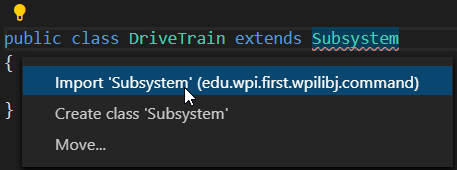
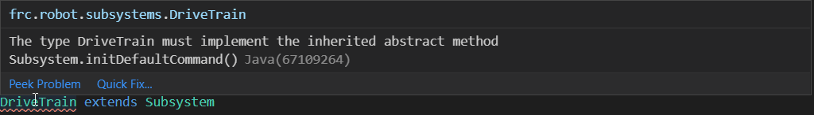
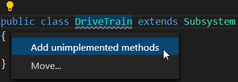
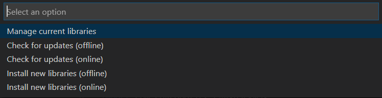
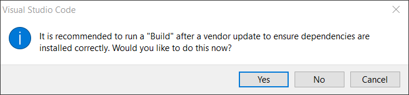

Creating the DriveTrain Subsystem
=================================

Subsystems are a vital and advantageous aspect of command-based programming. Subsystems are simple and create the input and output base of your robot. Each robot has multiple subsystems, such as the driveTrain, elevator, shooter, intake, and hanger. The training robot contains only one subsystem, the driveTrain. More subsystems can be added using the mounting holes on the sides of the robot. 

The main robot folder structure contains two extra folders, ``commands`` and ``subsystems``.

.. figure:: images/creating-the-drivetrain-subsystem-1.png
   :align: center
   
Right-click on the subsystems folder and create a new file called ``DriveTrain.java``. The file will open and be empty. Let's add the base code:

.. code-block:: java
   :linenos:
   
   package frc.robot.subsystem;
   
   
   public class DriveTrain extends Subsystem
   {
   
   }

Reviewing the code above:

1. Notice how unlike in ``GamepadConstants.java`` and ``RobotMap.java``, the package statement adds ``.subsystem``. This is because we are located in the subsystem folder of the robot. 

2. In our class declaration, we have added ``extends Subsystem``. This tells the compiler that we are adding the code in DriveTrain to the code in Subsystem. 

3. There is an error under Subsystem. This is because we have not imported Subsystem. To fix this, click on Subsystem, and you will see a yellow lightbulb pop up. If you click on the lightbulb, it will let you import Subsystem.

 
The import statement will be auto-added to the file. However, there is now an error under DriveTrain. If you hover your cursor over DriveTrain, you can view the error.  

   
What the error is stating is that by extending Subsystem, we also need to inherit and use a required function from Subsystem. To fix this, we can do the same step as with importing Subsystem. Click on DriveTrain, then click on the yellow lightbulb and select ``Add unimplemented methods``. This will automatically add the required method to the class. 

DriveTrain will now look like this:

.. code-block:: java
   :linenos:
   
   package frc.robot.subsystem;
   
   import edu.wpi.first.wpilibj.command.Subsystem;
   
   public class DriveTrain extends Subsystem
   {
      @Override
      protected void initDefaultCommand()
      {
        // TODO Auto-generated method stub

      }
   }

The automatically added method ``initDefaultCommand`` has a few new parts to it.

1. ``@Override`` - This tells the compiler to override the ``initDefaultCommand`` in Subsystem and use this one instead.

2. ``protected`` - This method is only accessible to classes inside the package. 

We can leave ``initDefaultCommand`` blank for now and return to it after creating the command in the next chapter. 

Before we continue, we need to add the Studica Titan Quad libraries to our project. This is easy in VS Code as it uses JSON links that are attached to maven repositories. The Studica Titan Quad library is located in a maven repository. To add the library, access the command palette using ``Ctrl+Shift+P`` or ``F1`` and type the following command ``WPILib: Manage Vendor Libraries``. This will open a list of choices, as shown. 

   
Select **Install new libraries(online)** and use the link http://dev.studica.com/releases/2020/Studica.json.

   
VS Code will then ask if you would like to build the project after adding the library. Hit yes, as this will download the library into the VS Code cache so that it can be used in offline mode. After adding the Titan Quad library, we will do the same for the NavX library https://www.kauailabs.com/dist/frc/2020/navx_frc.json. This will allow us to use the built-in NavX on the VMXpi. 

Now that the libraries are installed, we can go back and continue with the DriveTrain creation. To start, let's add a few lines of code:

.. code-block:: java
   :linenos:
   
   public class DriveTrain extends Subsystem
   {
      @Override
      protected void initDefaultCommand()
      {
        // TODO Auto-generated method stub

      }
      
      /**
       * Motor Controllers
       */
       
      private TitanQuad leftFront;
      private TitanQuad leftRear;
      private TitanQuad rightFront;
      private TitanQuad rightRear;
      
      
      /**
       * Sensors
       */ 
      
      private AHRS gyro;
      
      public DriveTrain()
      {
      
      }
   }

You will notice that ``TitanQuad`` and ``AHRS`` have errors under them. Use the lightbulb to import the library. There will now be a gold line under all the local motor declarations and gyro. This is a warning, what the warning is saying is that we have not used these yet. This warning can be ignored for now. 

Going over the added code:

1. ``private`` - we only want this motor instance to be accessible in this class

2. ``TitanQuad`` - this refers to the TitanQuad main class in the Studica library

3. ``leftFront`` - the local instance name for TitanQuad

4. ``AHRS`` - class for the NavX

5. ``gyro`` - the local instance name for AHRS 

6. We also create a constructor for the DriveTrain class.

In the constructor, let's add the code required to create instances of ``TitanQuad`` and ``AHRS``.

.. code-block:: java
   :linenos:
   
   public DriveTrain()
   {
      //Motor instances 
      leftFront = new TitanQuad(RobotMap.TITAN_CAN_ID, RobotMap.LEFT_DRIVE_FRONT);
      leftRear = new TitanQuad(RobotMap.TITAN_CAN_ID, RobotMap.LEFT_DRIVE_REAR);
      rightFront = new TitanQuad(RobotMap.TITAN_CAN_ID, RobotMap.RIGHT_DRIVE_FRONT);
      rightRear = new TitanQuad(RobotMap.TITAN_CAN_ID, RobotMap.RIGHT_DRIVE_REAR);
      
      //Invert right side motors
      rightFront.setInverted(true);
      rightRear.setInverted(true);
      
      //NavX instance
      try
      {
         gyro = new AHRS(SPI.Port.kMXP);
         gyro.enableBoardlevelYawReset(true); //Optional
         if(!gyro.isCalibrating())
         {
            Timer.delay(0.3);
            gyro.zeroYaw();
         }
      }
      catch (Exception e)
      {
         gyro = null;
      }
   }
   
1. Motor Instances - initiates an instance of the TitanQuad class for each motor. The first parameter is the CAN ID of the TitanQuad. The second parameter is the specific motor on the TitanQuad.

2. Invert Motors - these two lines invert the motors' outputs on the right side of the robot. This is required as when programming, we like to assume that a positive value means forward direction. In comparison, a negative value represents a reverse direction. 

3. NavX Instance - here the instance of the NavX built into the VMXpi is being created. We use a try-catch here in case there is an exception. It is not required but showcases an excellent way to create a new instance. AHRS has one parameter, and that is the port that it's connected to. For the VMXpi, this is the SPI port. We use ``SPI.port.kMXP``, which will tell the compiler the correct port to use. 

   .. note:: Sometimes VS Code won't import the SPI class correctly. The import is ``import edu.wpi.first.wpilibj.SPI;``

   **enableBoardlevelYawReset(true)** tells the NavX that we want the board to handle the yaw resets. Board level yaw resets maintain synchronization between the yaw angle and the sensor-generated Quaternion and Fused Heading values; however, when a reset occurs, the yaw might not be available for two cycles (~40ms). 
   
   **isCalibrating()** will return a true if the NavX is calibrating, a ``!`` is placed in front of it to invert the output. The case statement will only be true when isCalibrating returns false. If isCalibrating is false then we will wait 300ms and zero the yaw.
   
   **gyro = null** if there is an exception, we just nullify gyro. 
   
Creating Accessor & Mutator Methods
-----------------------------------

Currently, we don't have a way to access the information from the subsystem or a way to write to the subsystem. To overcome this, accessor and mutator methods are required. Accessor methods get the values of private fields. Mutator methods set the values of private fields.

Mutator Methods
^^^^^^^^^^^^^^^

Let's create the mutator methods for the right side and left side drive. This will allow us to control the speed of the motors.

.. code-block:: java
   :linenos:
   
   /**
    * Outputs speed to the right side motors
    * @param power_front output speed for the front motor (Range -1 to 1)
    * @param power_back output speed for the rear motor (Range -1 to 1)
    */
   public void runRightDrive(double power_front, double power_back)
   {
      rightFront.set(power_front);
      rightRear.set(power_back);
   }
   
   /**
    * Outputs speed to the left side motors
    * @param power_front output speed for the front motor (Range -1 to 1)
    * @param power_back output speed for the rear motor (Range -1 to 1)
    */
   public void runLeftDrive(double power_front, double power_back)
   {
      leftFront.set(power_front);
      leftRear.set(power_back);
   }

1. The Javadoc comment block allows us to state the input parameters and the range. 
2. ``public void`` - says that the method can be accessed from the outside and does not return anything. 
3. Inside the method, we set the motor speed based on the parameters inputted. 

We can also create the mutator method for zeroing the yaw.

.. code-block:: java
   :linenos:
   
   /**
    * Zeros the NavX Yaw Value
    */
   public void zeroYaw()
   {
      gyro.zeroYaw();
   }

This is a simple mutator as it has no parameters and performs one task, which is to zero the yaw of the NavX.

Accessor Methods
^^^^^^^^^^^^^^^^

We are only going to create one accessor method. This method will read the yaw value from the NavX.

.. code-block:: java
   :linenos:
   
   /**
    * @return the yaw value as a double (range ± 180°)
    */
   public double getYaw()
   {
      return gyro.getYaw();
   }
   
1. The Javadoc comment shows what is being returned by the method.
2. ``public double`` - says that the method can be accessed from the outside and that it will return a double value.

.. important:: For now, the driveTrain class is completed, but we will come back to it after creating the drive command. 

