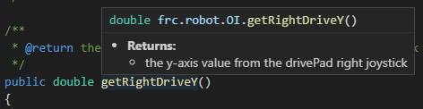

Operator Interface
==================

``OI.java`` or otherwise know as operator interface, is used to scan inputs coming from the joysticks and gamepads plugged into the computer. After grabbing the inputs, it will need to be manipulated into a usable form for the robot to interpret and use in other classes. 

The base OI.java class

.. code-block:: java
   :linenos:
   
   package frc.robot;

   /**
    * This class is the glue that binds the controls on the physical operator
    * interface to the commands and command groups that allow control of the robot.
    */
   public class OI
   {
    
   }
   
The OI class is essentially empty. Populating the class is very repetitive but easy. 

To start, the Joystick class needs to be imported. 

.. code-block:: java
   :linenos:
   
   package frc.robot;
   
   import edu.wpi.first.wpilibj.Joystick;
   
   /**
    * This class is the glue that binds the controls on the physical operator
    * interface to the commands and command groups that allow control of the robot.
    */
   public class OI

The Joystick class handles the inputs from controllers connected to the driver station. After importing the class, the class needs to be defined.

.. code-block:: java
   :linenos:
   
   public class OI
   {
      
      //Initialize Gamepads
      Joystick drivePad;
      
   }
   
For us to create and use multiple methods in ``OI.java``, a constructor is required to create an instance. 

.. code-block:: java
   :linenos:
   
   public class OI
   {
      
      //Initialize Gamepads
      Joystick drivePad;
      
      public OI()
      {
         drivePad = new Joystick(GamepadConstants.DRIVE_USB_PORT);
      }
   
   }
   
In the constructor, we will also create a new instance of Joystick. Joystick needs to know the port that the controller is connected to. Here is where classes like GamepadConstants shine. Instead of typing in ``0``, we can use ``GamepadConstants.DRIVE_USB_PORT``. That way, we don't have to look up what the actual port is constantly, and if we ever make a change to the port number, we only have to change GamepadConstants and not our whole project. 

.. hint:: GamepadConstants does not need to be imported as it is part of the frc.robot package. 

Now that the constructor is made, we can create a method for each input from the controller. Let's start with the right joystick. 

.. code-block:: java
   :linenos: 
   
   /**
    * @return the y-axis value from the drivePad right joystick
    */
   public double getRightDriveY()
   {
      double joy = drivePad.getRawAxis(GamepadConstants.RIGHT_Y);
      if(Math.abs(joy) <= 0.05)
         return 0.0
      else
         return joy;
   }

A lot is going on in this method. 

1. The comment block is a JavaDoc comment, meaning it allows for tags to be used. In this case, we are using a @return tag. What this does is that it tells the user that the returned value when calling this method is the y-axis value from the drivePad right joystick. An example is shown below. 

   
2. The method is a public double with the method name of ``getRightDriveY``. There are also no parameters for the method as the ``()`` are empty. The public declaration means that this method can be called from outside ``OI.java``. ``double`` tells the compiler that the method will return a value in the data type of a double. 

3. A double variable named ``joy`` is created to hold the value obtained by calling drivePad.getRawAxis(). The GamepadConstants.RIGHT_Y in the ``()`` tells getRawAxis() the port to use when returning the value. 

.. important:: getRawAxis returns a value of -1 to 1. 

4. When joysticks are idle, the value reported is almost always not precisely 0. This is due to wear and tear, along with the design of joysticks. To overcome this, a dead zone is used. In this case, a simple case statement is created to see if the absolute value of joy is less than 0.05. With an absolute range of 0 to 1, 0.05 is 5%. This means that if the value of joy is in the range of -0.05 to 0.05, instead of returning the actual value, it will report 0.0. 

The last three joystick methods are similar to getRightDriveY, just that the method name and GamepadConstants constant changes. 

.. code-block:: java
   :linenos:
   
   /**
    * @return the y-axis value from the drivePad right joystick
    */
   public double getRightDriveY()
   {
      double joy = drivePad.getRawAxis(GamepadConstants.RIGHT_Y);
      if(Math.abs(joy) <= 0.05)
        return 0.0;
      else  
        return joy;
   }

   /**
    * @return the x-axis value from the drivePad right Joystick
    */
   public double getRightDriveX()
   {
      double joy = drivePad.getRawAxis(GamepadConstants.RIGHT_X);
      if(Math.abs(joy) <= 0.05)
        return 0.0;
      else
        return joy;
   }

   /**
    * @return the y-axis value from the drivePad left joystick
    */
    public double getLeftDriveY()
    {
       double joy = drivePad.getRawAxis(GamepadConstants.LEFT_Y);
       if(Math.abs(joy) <= 0.05)
         return 0.0;
       else  
         return joy;
    }
 
    /**
     * @return the x-axis value from the drivePad left Joystick
     */
    public double getLeftDriveX()
    {
       double joy = drivePad.getRawAxis(GamepadConstants.LEFT_X);
       if(Math.abs(joy) <= 0.05)
         return 0.0;
       else
         return joy;
    }
      
The joystick inputs are now complete; however, we still need to create the methods for the button inputs from the controller. Let's start with the X button on the controller.

.. code-block:: java
   :linenos:
   
   /**
    * @return a true or false depending on the input
    */
   public boolean getDriveXbutton()
   {
     return drivePad.getRawButton(GamepadConstants.X_BUTTON);
   }
   
Buttons are a bit simpler as they are a boolean true or false. As we are not required to do a dead zone check, we can output the value read from getRawButton direct to the return statement.  

Now that we know how to do a boolean read for a button. Let's complete ``OI.java`` by added the missing buttons.

.. code-block:: java
   :linenos:
   
   /**
    * @return a true or false depending on the input
    */
   public boolean getDriveRightTrigger()
   {
     return drivePad.getRawButton(GamepadConstants.R2_BUTTON);
   }
   
   /**
    * @return a true or false depending on the input
    */
   public boolean getDriveRightBumper()
   {
     return drivePad.getRawButton(GamepadConstants.R1_BUTTON);
   }

   /**
    * @return a true or false depending on the input
    */
   public boolean getDriveLeftTrigger()
   {
     return drivePad.getRawButton(GamepadConstants.L2_BUTTON);
   }

   /**
    * @return a true or false depending on the input
    */
   public boolean getDriveLeftBumper()
   {
     return drivePad.getRawButton(GamepadConstants.L1_BUTTON);
   }

   /**
    * @return a true or false depending on the input
    */
   public boolean getDriveXButton()
   {
     return drivePad.getRawButton(GamepadConstants.X_BUTTON);
   }

   /**
    * @return a true or false depending on the input
    */
   public boolean getDriveTriangleButton()
   {
     return drivePad.getRawButton(GamepadConstants.TRIANGLE_BUTTON);
   }

   /**
    * @return a true or false depending on the input
    */
   public boolean getDriveCircleButton()
   {
     return drivePad.getRawButton(GamepadConstants.CIRCLE_BUTTON);
   }

   /**
    * @return a true or false depending on the input
    */
   public boolean getDriveSquareButton()
   {
     return drivePad.getRawButton(GamepadConstants.SQUARE_BUTTON);
   }

   /**
    * @return a true or false depending on the input
    */
   public boolean getDriveShareButton()
   {
     return drivePad.getRawButton(GamepadConstants.SHARE_BUTTON);
   }

   /**
    * @return a true or false depending on the input
    */
   public boolean getDriveOptionsButton()
   {
     return drivePad.getRawButton(GamepadConstants.OPTIONS_BUTTON);
   }

   /**
    * @return a true or false depending on the input
    */
   public boolean getDriveRightAnalogButton()
   {
     return drivePad.getRawButton(GamepadConstants.R3_BUTTON);
   }

   /**
    * @return a true or false depending on the input
    */
   public boolean getDriveLeftAnalogButton()
   {
     return drivePad.getRawButton(GamepadConstants.L3_BUTTON);
   } 
   
   /**
    * @return a true or false depending on the input
    */
   public boolean getDriveTouchPadButton()
   {
     return drivePad.getRawButton(GamepadConstants.TOUCHPAD_BUTTON);
   } 
   
   /**
    * @return a true or false depending on the input
    */
   public boolean getDrivePsButton()
   {
     return drivePad.getRawButton(GamepadConstants.PS_LOGO_BUTTON);
   } 
   

