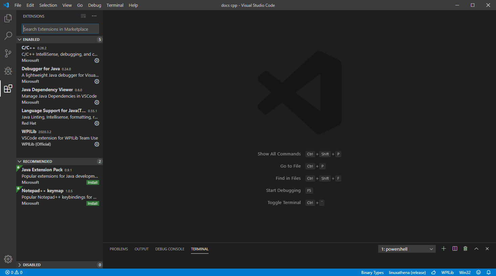
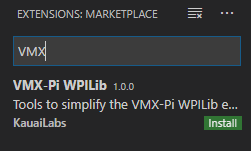
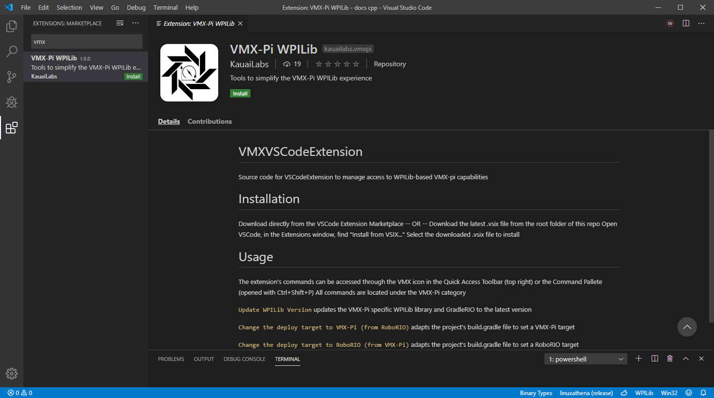
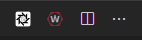

Configuring the project for VMXpi
=================================

This guide will show the steps required to configure the project to be deployed to the VMXpi.
      
Installing VMXpi Extension
--------------------------

A VSCode extension was created to manage the ``build.gradle`` file in the project folder. The extension allows for the project to swap between the roboRIO and VMXpi as targets for deployment. 

To install the extension head over to the Extensions tab on the left panel or hit ``Ctrl + Shift + X``. 

   
In the search bar, search for ``VMX``.

   
Click on the extension to open the extension page in the main window.

   
Click on ``Install`` to install the extension. 

The installation will be successful when you see the VMXpi logo pop up next to the WPILib logo.

Using the Extension
-------------------

There are four commands in the extension palette.

.. figure:: images/configuring-the-project-for-vmxpi-5.png
   :align: center
   
-  ``Update WPILib Version`` will update to the current GradleRIO version for the VMXpi
-  ``Change the deploy target to VMX-Pi (from RoboRIO)`` will update the ``build.gradle`` file to use the VMXpi as a target
-  ``Change the deploy target to RoboRIO (from VMX-Pi)`` will update the ``build.gradle`` file to use the roboRIO as a targets
-  ``Verify the Project's build.grade file`` checks if everything is good to go with the file

To switch the project over for the VMXpi, the command ``Change the deploy target to VMX-Pi (from RoboRIO)`` needs to be run. After running, it will auto rebuild the project and cache any libraries that are missing. 