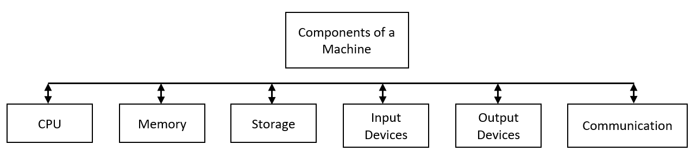
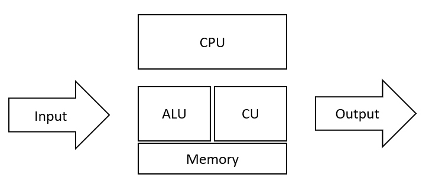
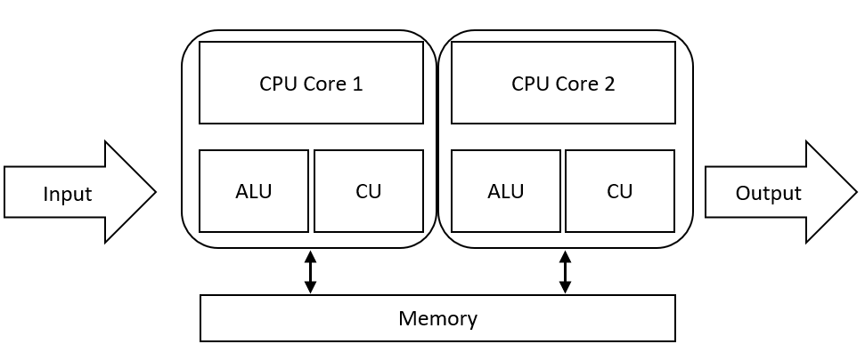
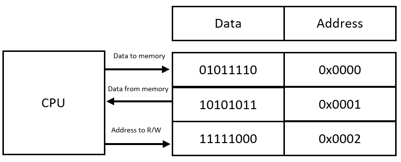

What is a Machine?
==================

A machine, sometimes known as a computer is a device that has *hardware* and *software*. The hardware layer consists of physical nature. This is what can be seen by the human eye and felt. Software is the invisible layer that instructs the hardware on what to do. Knowing how hardware works, is not required; however, it will, in turn, make any code written more efficient and better. In this chapter, we will discuss how the hardware and software layers interact.

Components of a Machine
-----------------------

   
A machine has six core components:

-  Central Processing Unit ``CPU``
-  Memory ``RAM``
-  Storage ``Data``
-  Input Devices ``keyboard`` and ``mouse``
-  Output Devices ``speakers`` and ``monitors``
-  Communication ``ethernet`` and ``WiFi``

Central Processing Unit
^^^^^^^^^^^^^^^^^^^^^^^

The *central processing unit* ``CPU`` is the brain of the whole operation. The CPU gets instructions from memory and acts on those instructions. When a CPU acts on instruction from memory, it is called executing. There are two primary components of a CPU, the *control unit* ``CU`` and the *arithmetic logic unit* ``ALU``. The control unit will instruct the components on what and when to do something. The arithmetic unit will perform any mathematical or logical operation. Below is a breakdown of the underlying architecture of a CPU.

A CPU is very advanced and has two main aspects of rating, *speed*, and amount of *cores*. The speed of a CPU is measured in *hertz* ``Hz``. 1 Hz is equal to 1 cycle per second. Some of today's high-end CPUs can hit 5 GHz, which is 5,000,000,000 cycles per second. The `Z3 <https://en.wikipedia.org/wiki/Z3_(computer)>`__, which was the first programmable digital computer, only had a speed of 4 - 5 Hz. The CPU's of today have multiple cores to increase the processing power. The picture above shows a single-core CPU as there is only one ALU and CU. Today's CPUs have 2,4,6,8,16,32+ cores. Shown below is a multicore processor with basic architecture.

   
Memory
^^^^^^

*Memory* is information stored for immediate use by a CPU. Before a program can be executed by the CPU, it must be moved to memory. Memory generally has two components, an *address*, and *data*. The data in memory is only one byte long and always has a unique address. Because memory bytes can be accessed in any order, memory is commonly referred to as *random-access memory* ``RAM``. Below is a simple diagram showing the two components of RAM and how it interacts with the CPU.

   
Storage
^^^^^^^

Memory is a volatile type of data storage. This means that when the machine is powered off, all data stored in memory will be erased. To overcome this, machines use *storage devices*. Storage devices allow for data to be stored permanently. Some common types of storage are *hard drives* ``HD``, *solid-state drives* ``SSD``, and *universal serial bus* flash drives ``USB``. Each type of drive has its own pros and cons. HD's allow for a large amount of storage; however, they are slow compared to the other types. This is because HD's are mostly mechanical and have moving parts. An SSD is extremely quick and has no moving parts; however, SSD's are more expensive and have less storage than HD's. USBs have a small amount of storage but are cheap and offer portability.  

Input Devices
^^^^^^^^^^^^^

Input devices allow the user to communicate with the machine. The two most common input devices are the *keyboard* and the *mouse*. The keyboard allows the user to type in data on to the machine. Keyboards bind a keypress to a particular language to understand what is being sent by the user. On most English keyboards, they use `ASCII <http://www.asciitable.com/>`__ codes to interoperate what was pressed by the user. The mouse is simply a pointer that allows the user to click on-screen objects and perform actions.

Output Devices
^^^^^^^^^^^^^^

Output devices allow the machine to communicate with the user. Some conventional output devices are *monitors* and *speakers*. Monitors provide a graphical interface for the user. Although its good to note that not all monitors are graphical, some are simple text-based interfaces. Speakers allow the machine to output sound to the user. This is particularly useful if there is an error somewhere or simply acknowledge an action taken by the user. 

Communication 
^^^^^^^^^^^^^

There are multiple forms and layers of communication completed by a machine. A mouse uses different ways of communication, depending on the mouse. A wired mouse will use a USB port and communicate using serial communication. A wireless mouse will use a technology known as *Bluetooth*. Bluetooth allows for short-range wireless communication. Some other common forms are *ethernet* and *WiFi*. Ethernet and WiFi are mostly the same and follow the same `OSI <https://en.wikipedia.org/wiki/OSI_model>`__ layer protocols. The main difference is that ethernet is a wired communication, whereas WiFi is wireless communication. Ethernet will provide a more stable and, most of the time, a faster connection than WiFi. This is because there can be other radio waves or outside `noise <https://en.wikipedia.org/wiki/Radio_noise>`__ impacting the strength of WiFi. 

            

   