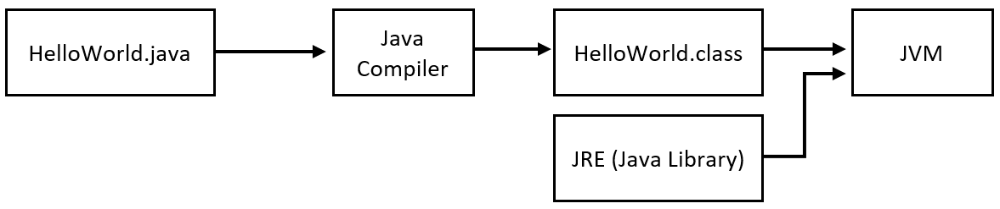

How a Simple Java Program is Executed
=====================================

Let's look back at a simple Java program.

HelloWorld.java
---------------

.. code-block:: java
   :linenos:
   
   public class HelloWorld
   {
      public static void main(String[] args)
      {
         //Display message Hello World! on the console
         System.out.println("Hello World!");
      }
   }
   
Output

.. code-block:: text

   Hello World!
 

What we will look at it in this chapter is how the source code in HelloWorld outputs to the console. 

The general process is outlined in the graphic below.

   
The process starts by taking the ``HelloWorld.java`` source code file and sending it through the Java compiler. After going through the compiler there is a new file create called ``HelloWorld.class`` this is the Java bytecode file that the JVM will be able to interpret. After the ``.class`` file is created it will join the the JRE and call the JVM. The JVM will then output to the console window displaying the text ``Hello World!``.

Let's look at this process in even more detail. The source code is shown at the top of this chapter. 

The compiler is called by using

.. code-block:: bash
   
   javac HelloWorld.java
   
This will run and then create the ``HelloWorld.class`` file if there are no errors. 

HelloWorld.class
^^^^^^^^^^^^^^^^

.. code-block:: text
   :linenos:
   
   Compiled from "HelloWorld.java"
   public class HelloWorld {
   public HelloWorld();
      Code:
         0: aload_0
         1: invokespecial #1                  // Method java/lang/Object."<init>":()V
         4: return

   public static void main(java.lang.String[]);
      Code:
         0: getstatic     #2                  // Field java/lang/System.out:Ljava/io/PrintStream;
         3: ldc           #3                  // String Hello World!
         5: invokevirtual #4                  // Method java/io/PrintStream.println:(Ljava/lang/String;)V
         8: return
   }

The bytecode looks completely different than the source code. There are some similarities that can be spotted. The HelloWorld.class can be executed by the JVM when ever required. Now that the bytecode is created when the JVM is called it will create the console window output.

Output

.. code-block:: text

   Hello World!
   
Now we know how we get from the source code to the compiled output in the console window.
      
 