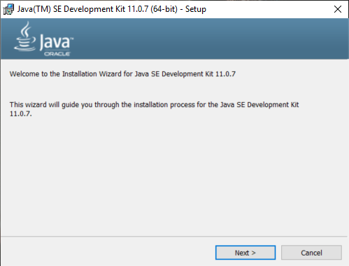
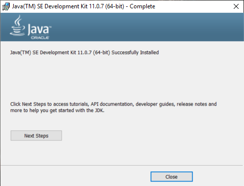
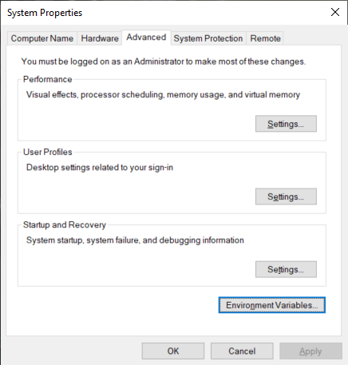
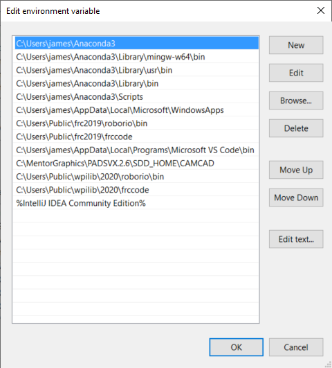

Downloading the JDK
===================

The Java JDK is required for most development in Java. 

Installing the JDK
------------------

The latest JDK can be found on the Oracle website `here <https://www.oracle.com/java/technologies/javase-jdk11-downloads.html>`__. Select the correct install for your OS.

.. note:: An Oracle account will be required to download ``JDK 11``. This is due to the recent release of ``JDK 14``. The IDE we use in the curriculum does support the new JDK; however, the workaround is something we won't be covering in this curriculum. 

Run the JDK installation file, this will require Admin privileges. 

   
The installation wizard will open. Follow the prompts and install the JDK. When complete you should see a window like the one below. 

   
Adding Java to PATH
-------------------
   
Sometimes the JAVA_HOME is not set correctly after installing the JDK. To verify if you have the JAVA_HOME set correctly open the command prompt and type in the following command. 

.. code-block:: bash
   
   java 
   
If it is not set correctly you will see the following error:

.. code-block:: text

   'java' is not recognized as an internal or external command,
   operable program or batch file.
   
To fix this we need to add JAVA_HOME to the PATH in environment variables. To get to environment variables hit the ``WIN`` + ``R`` key to open run. In run type ``"SystemPropertiesAdvanced"`` and hit enter. This will open the Advanced tab in System Properties. 

   
Select ``Environment Variables``.

.. figure:: images/downloading-the-jdk-4.png
   :align: center
   
In the first section ``User variables``, Find the variable ``Path`` and select it and hit ``Edit...``. 

   
Hit ``New`` and enter the following ``C:\Program Files\Java\jdk-11.0.7\bin``.

.. important:: If you installed the JDK in a different location use that path instead.

Repeat the same process above for the ``System variables``.

To verify that the Path is set correctly open the command prompt again and enter the command ``java``. There should be a response as shown below. 

.. code-block:: bash

   C:\Windows\system32>java
   Usage: java [options] <mainclass> [args...]
              (to execute a class)
      or  java [options] -jar <jarfile> [args...]
              (to execute a jar file)
      or  java [options] -m <module>[/<mainclass>] [args...]
          java [options] --module <module>[/<mainclass>] [args...]
              (to execute the main class in a module)
      or  java [options] <sourcefile> [args]
              (to execute a single source-file program)

    Arguments following the main class, source file, -jar <jarfile>,
    -m or --module <module>/<mainclass> are passed as the arguments to
    main class.

    where options include:

       -cp <class search path of directories and zip/jar files>
       -classpath <class search path of directories and zip/jar files>
       --class-path <class search path of directories and zip/jar files>
                     A ; separated list of directories, JAR archives,
                     and ZIP archives to search for class files.
       -p <module path>
       --module-path <module path>...
                     A ; separated list of directories, each directory
                     is a directory of modules.
       --upgrade-module-path <module path>...
                     A ; separated list of directories, each directory
                     is a directory of modules that replace upgradeable
                     modules in the runtime image
       --add-modules <module name>[,<module name>...]
                     root modules to resolve in addition to the initial module.
                     <module name> can also be ALL-DEFAULT, ALL-SYSTEM,
                     ALL-MODULE-PATH.
       --list-modules
                     list observable modules and exit
       -d <module name>
       --describe-module <module name>
                     describe a module and exit
       --dry-run     create VM and load main class but do not execute main method.
                     The --dry-run option may be useful for validating the
                     command-line options such as the module system configuration.
       --validate-modules
                     validate all modules and exit
                     The --validate-modules option may be useful for finding
                     conflicts and other errors with modules on the module path.
       -D<name>=<value>
                     set a system property
       -verbose:[class|module|gc|jni]
                     enable verbose output for the given subsystem
       -version      print product version to the error stream and exit
       --version     print product version to the output stream and exit
       -showversion  print product version to the error stream and continue
       --show-version
                     print product version to the output stream and continue
       --show-module-resolution
                     show module resolution output during startup
       -? -h -help
                     print this help message to the error stream
       --help        print this help message to the output stream
       -X            print help on extra options to the error stream
       --help-extra  print help on extra options to the output stream
       -ea[:<packagename>...|:<classname>]
       -enableassertions[:<packagename>...|:<classname>]
                     enable assertions with specified granularity
       -da[:<packagename>...|:<classname>]
       -disableassertions[:<packagename>...|:<classname>]
                     disable assertions with specified granularity
       -esa | -enablesystemassertions
                     enable system assertions
       -dsa | -disablesystemassertions
                     disable system assertions
       -agentlib:<libname>[=<options>]
                     load native agent library <libname>, e.g. -agentlib:jdwp
                     see also -agentlib:jdwp=help
       -agentpath:<pathname>[=<options>]
                     load native agent library by full pathname
       -javaagent:<jarpath>[=<options>]
                     load Java programming language agent, see java.lang.instrument
       -splash:<imagepath>
                     show splash screen with specified image
                     HiDPI scaled images are automatically supported and used
                     if available. The unscaled image filename, e.g. image.ext,
                     should always be passed as the argument to the -splash option.
                     The most appropriate scaled image provided will be picked up
                     automatically.
                     See the SplashScreen API documentation for more information
       @argument files
                     one or more argument files containing options
       -disable-@files
                     prevent further argument file expansion
       --enable-preview
                     allow classes to depend on preview features of this release
   To specify an argument for a long option, you can use --<name>=<value> or
   --<name> <value>.
   

