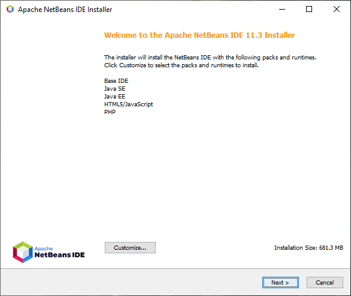
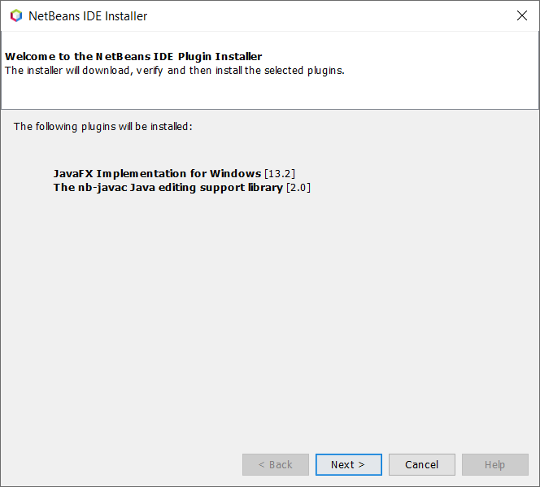
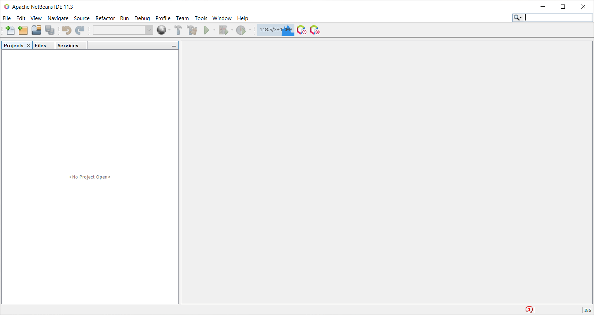

Installing an IDE
=================

Writing programs in notepad and compiling them works and is ok for small programs. But for creating and managing large projects a piece of software called and Integrated Development Environment ``IDE`` is required. The IDE used for this curriculum is NetBeans. 

Download NetBeans 11.3 `here <https://netbeans.apache.org/download/nb113/nb113.html>`__. 

   
Launch the installer and go through the prompts. 

Once installed open NetBeans and this prompt will come up. 

   
Hit ``next`` and go through the plugin installer. It is recommended to install all the default plugins listed. When complete the IDE window should look like this. 

   

