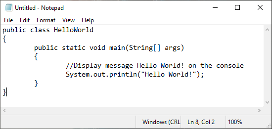
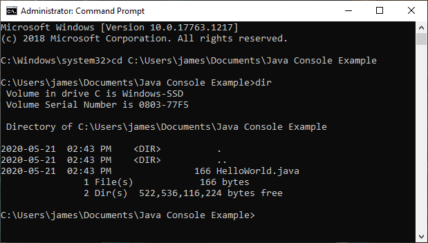
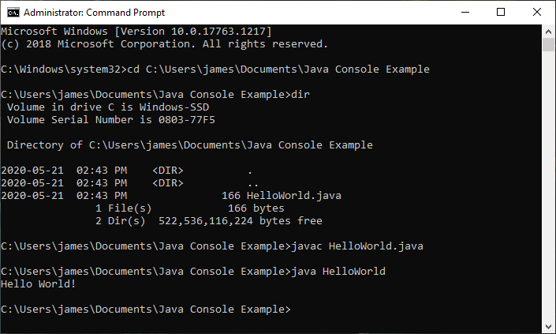

Writing your first Java Program
===============================

With the JDK installed we can now create our first Java program. 

Creating the Simple Java Program
--------------------------------

Open notepad and enter in the Simple Java Program. If you have forgotten the code is listed below. 

.. code-block:: java
   :linenos:
   
   public class HelloWorld
   {
      public static void main(String[] args)
      {
         //Display message Hello World! on the console
         System.out.println("Hello World!");
      }
   }
   

   
.. important:: Remember to save the file as ``HelloWorld.java``. 

Compiling the Simple Java Program
---------------------------------

To compile ``HelloWorld.java`` open command prompt as **Administrator**.

Navigate to the location of ``HelloWorld.java``.  An example is shown below.

   
Once navigated to the correct folder you can verify ``HelloWorld.java`` is there by using the command ``dir``. 

Once ``HelloWorld.java`` is verified to be in the folder run the following command.

.. code-block:: bash

   javac HelloWorld.java

Running the Simple Java Program
-------------------------------

While still in the location of the ``HelloWorld.java`` in the command prompt run the command:

.. code-block:: bash

   java HelloWorld
   

   
.. tip:: If you would like view the Java bytecode you can run the command ``javap -c HelloWorld.class``.