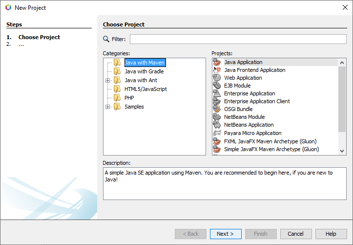
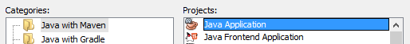
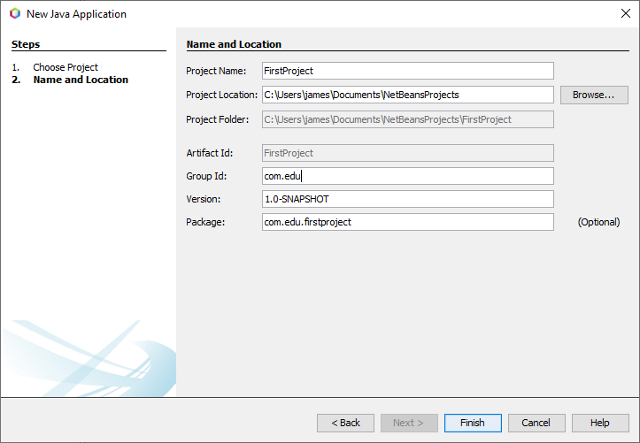
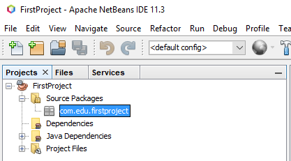
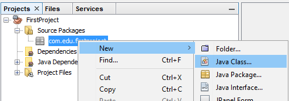
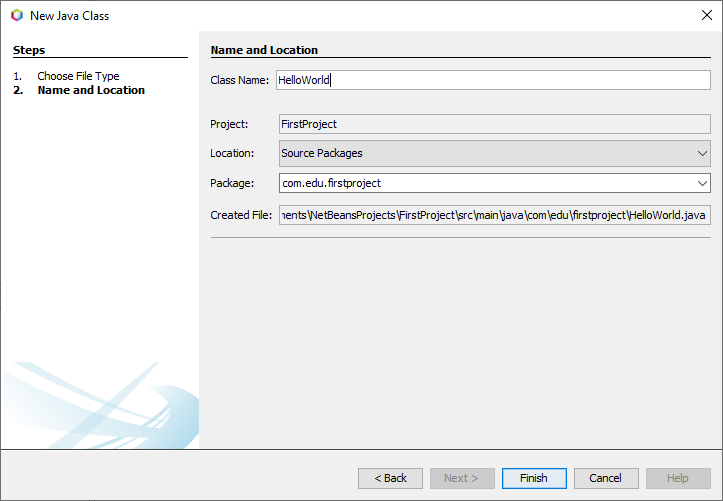
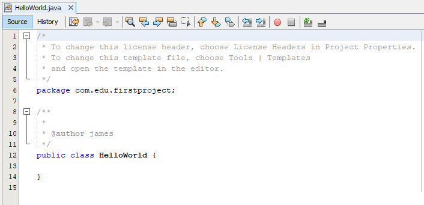
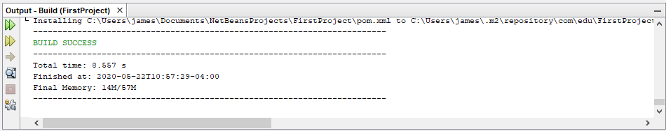
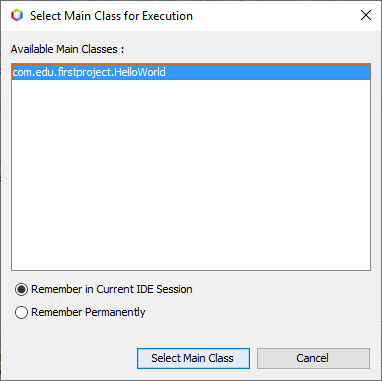
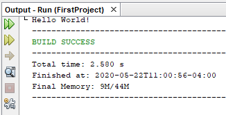

Using the IDE 
=============

Now that the IDE is installed we can start writing some Java code without needing the command prompt. 

Creating a Project
------------------

The first step is to create a Java project. Open NetBeans and select ``New Project``. This can be done by going to ``File>New Project``, using the shortcut ``Ctrl + Shift + N`` or by clicking on the icon as shown.

   
This will open up the project creation window.

   
We are going to use ``Java with Maven`` and select ``Java Application`` for projects.

 
.. hint:: Maven is a project automation tool used for building Java projects. You can find out more `here <https://maven.apache.org/>`__

For **Project Name** use ``FirstProject`` and for **Group Id:** use ``com.edu``.

   
This will create the project. In the project window on the left you will see a project displayed called ``FirstProject``. This is the project we just created.

Adding a Java file to the Project
---------------------------------

To create a Java file right click on ``com.edu.firstproject`` and select ``New > Java Class``.

   
This will open another window for creating the Java Class.

   
The **Class Name** should be ``HelloWorld``. Hit Finish when ready and the Java file will be created and added to the project. 

   
The ``HelloWorld.java`` file will automatically open for editing. Let's break down what each section of the default template is.

.. code-block:: java
   :linenos: 

   /*
    * To change this license header, choose License Headers in Project Properties.
    * To change this template file, choose Tools | Templates
    * and open the template in the editor.
    */
    
This is the *License header*. License headers are normally required when you are going to release code or projects to the public. For personal use they are not really required. 

.. code-block:: java
   :linenos:
   :lineno-start: 6
   
   package com.edu.firstproject;
   
*Packages* are a way of organizing Java classes into a namespace. This is mostly useful for when you create a library and the library requires multiple classes. 

.. code-block:: java
   :linenos:
   :lineno-start: 8
   
   /**
    *
    * @author james
    */
    
This is the Javadoc comment for the HelloWorld Class. Notice how the author tag is automatically added for you. This is useful for tracking who created what. Some projects can get very big and tracking down the author can be crucial. 

.. code-block:: java
   :linenos:
   :lineno-start: 12
   
   public class HelloWorld {
    
   }
   
This is the class definition. This is created by default to prevent errors with the class name not matching the filename. Notice how the class is currently using the indentation style of K&R. We will change this to Allman by moving the starting brace ``{`` to line 13. We should get this:

.. code-block:: java
   :linenos:
   :lineno-start: 12

   public class HelloWorld   
   {
    
   }
   
Adding the Simple Java Program
------------------------------

Let's add the simple Java program, compile it, then run it. 

To add the simple Java program to the HelloWorld.java we can see that we are only missing one section. The contents of of the HelloWorld class.

Add this to the contents of the HelloWorld class

.. code-block:: java
   :linenos:
   
   public static void main(String[] args)
   {
      //Display message Hello World! on the console
      System.out.println("Hello World!");
   }
   
The ``HelloWorld.java`` should now fully look like this:

.. code-block:: java
   :linenos:
   
   /*
    * To change this license header, choose License Headers in Project Properties.
    * To change this template file, choose Tools | Templates
    * and open the template in the editor.
    */
   package com.edu.firstproject;

   /**
    *
    * @author james
    */
   public class HelloWorld
   {
      public static void main(String[] args)
      {
         //Display message Hello World! on the console
         System.out.println("Hello World!");
      }
   }
   
To compile the project we will hit the build icon or use ``F11``. 

   
You should notice a window popup on the bottom of the IDE. This is the output console.

   
.. note:: On first build maven might take a few seconds as it will downloading dependencies need for compilation. 

To run the project and see some output we hit the green arrow by the build icon. Alternatively ``F6`` can be used as well.

   
A popup will come up asking you to select the main class.

   
Select ``com.edu.firstproject.HelloWorld`` and hit the ``Select Main Class`` button. The project will then run and the output can be seen in the console window as displayed below. 

   
   