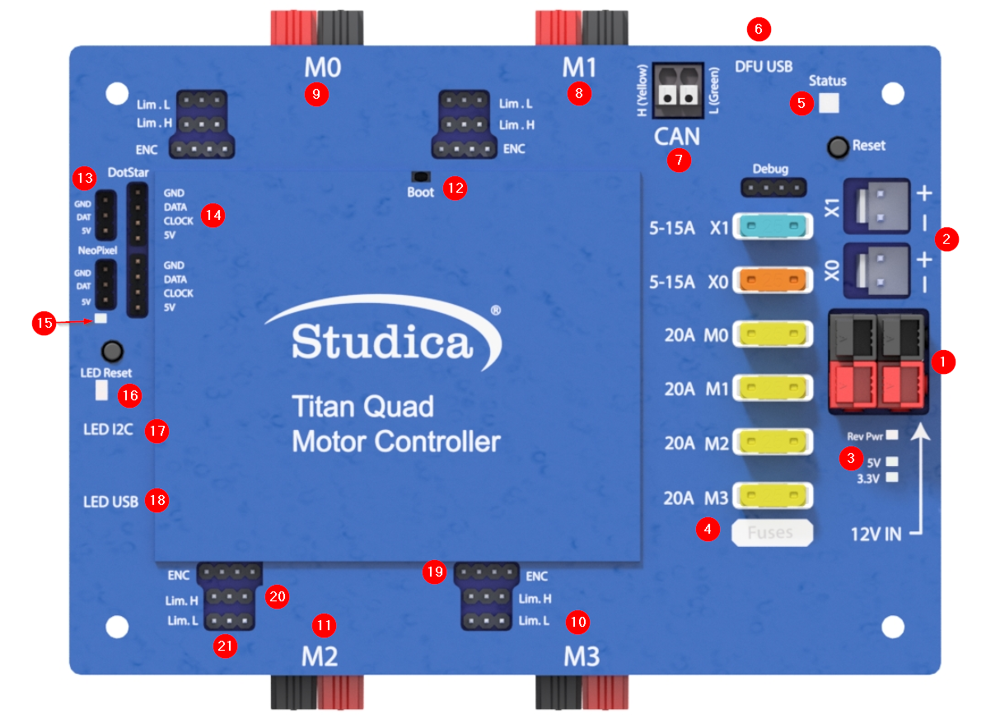

Titan Quad 
==========

The Titan Quad is a motor controller with four DC motor outputs that operate on the CAN Bus. Developed for World Skills but adapted for other uses. 

Map
---

   
1. Power input. Input requires a 12VDC battery, and two ports are available connected in parallel. Both ports can be used for increasing the capacity or as a battery in, battery out.  

2. Power output. Outputs 12VDC out to other devices such as, VMXpi or Servo Power Block. 

3. Voltage indicators. There is a reverse power indicator (red) that will light up if the voltage is connected in reverse. The other two indicators display the voltage rails 5V and 3.3V.

4. Fusebox. Before voltage can be applied to the motors or power outputs (2), an appropriate fuse must be inserted into the box. Motors take 20A fuses, and power outputs take 5 - 15A fuses.

5. RGB Status Light.

6. DFU USB - used to communicate with the computer for updates and configuration.

7. CAN-BUS Input - High side (yellow) and Low side (green) inputs.

8. M1 - Motor 1 output.

9. M0 - Motor 0 output.

10. M3 - Motor 3 output.

11. M2 - Motor 2 output.

12. Boot - used only when an error occurs, and Titan cannot communicate with the computer and needs a firmware upgrade. 

13. NeoPixel - addressable LED output

14. DotStar - addressable LED output

15. Pin 13/ L for LED microcontroller

16. RX/TX - LEDs for microcontroller

17. LED i2c - com port for microcontroller

18. LED USB - used to communicate with the computer for uploading code

19. Encoder port - Quadrature encoder input

20. Limit H - High limit switch input. (Limits are pulled high and use hardware debouncing)

21. Limit L - Low limit switch input. (Limits are pulled high and use hardware debouncing)

Electrical Characteristics
--------------------------

.. list-table:: Electrical Characteristics
   :widths: 30 10 10 10
   :header-rows: 1
   :align: center
   
   *  - Function
      - Min
      - Nom
      - Max
   *  - Input Voltage
      - 10VDC
      - 12VDC
      - 14VDC
   *  - Output Voltage
      - 10VDC
      - 12VDC
      - 14VDC
   *  - Motor Output Amperage
      - 0A
      - 
      - 20A
   *  - Motor Frequency
      - 0Hz
      - 15.6KHz
      - 20KHz
   *  - Encoder Voltage Output
      - 4.5V
      - 5V
      - 5.5V
   *  - Limit Switch Output
      - 4.5V
      - 5V
      - 5.5V
   *  - LED Voltage Output
      - 4.5V
      - 5V
      - 5.5V
   *  - LED Output Amperage
      - 0A
      - 
      - 6A
      