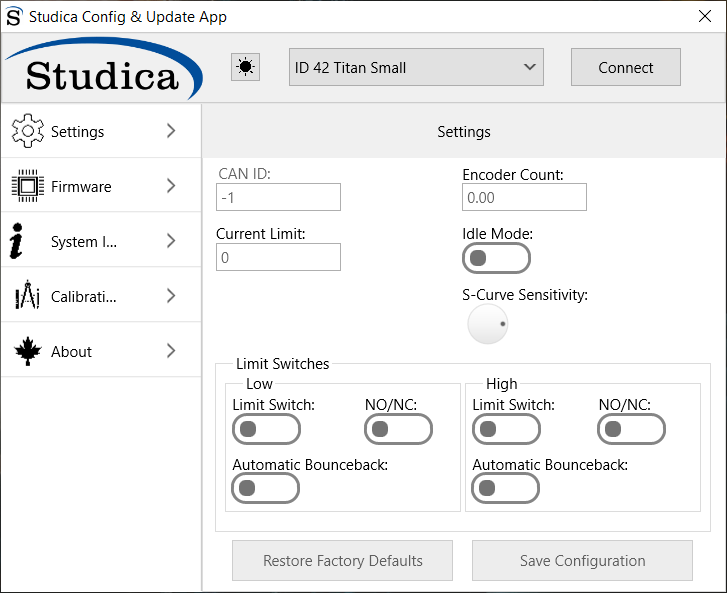
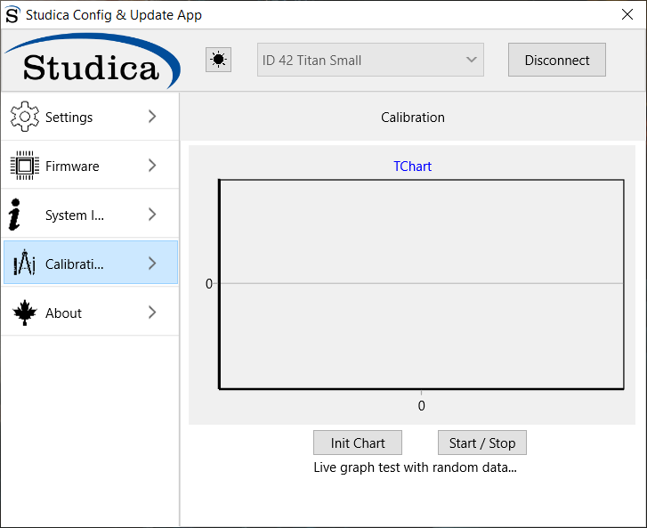

Using the Update App
====================

The Studica Update and Config app was created to allow users to get the most out of their Titan motor controller. 

Settings
--------

The landing or Settings page allows for the setting of the custom CAN ID, Encoder Ticks per rev for the motor your using, current limit for the motors, Motor idle mode, S-curve sensitivity and limit switch control. 

When a valid device is found by the app it will be displayed in the drop down menu. 

.. note:: The default CAN ID out of the box is 42. 

CAN ID
^^^^^^

The CAN ID is the unique id of the motor controller on the CAN bus. The valid range is 1 - 62. 

Encoder Count
^^^^^^^^^^^^^

Is the counts per revolution of the encoder you are using on your motor. For example the Studica Maverick has a CPR of 732, whereas the Pitsco Torquenado has a CPR of 1440. 

Current Limit
^^^^^^^^^^^^^

This is the limit you want for the amount of current to flow to the motors. Valid range 0 - 20A.

Idle Mode
^^^^^^^^^

When false this sets the motors to coast mode and when high the motors are in break mode.

S-Curve Sensitivity
^^^^^^^^^^^^^^^^^^^

Sets the sensitivity level of the S-Curve formula.

Limit Switches
^^^^^^^^^^^^^^

Control panel for limit switch configuration. There are two limit switch ports per motor on the Titan, a high and a low. 

Parameters
-  Limit Switch - Simple enable and disable
-  NO/NC - let the microcontroller know if you are using a NO contact or a NC contact (inverts the output)
-  Automatic Bounce back - upon making contact with the limit switch the motor will move in the opposite direction just a little bit.

Save Configuration 
^^^^^^^^^^^^^^^^^^

Saves the current settings to the Titan.

Restore Factory Defaults
^^^^^^^^^^^^^^^^^^^^^^^^

Will restore the Titan back to it's recommended factory settings. 

Firmware
--------

Every so often a firmware upgrade is required to fix a bug or include new functionality. 

.. figure:: images/using-the-update-app-3.png
   :align: center
   
The firmware upgrade tab will search for an update online and install if there is one. 

System Info
-----------

System Information is used for diagnosing and contacting support.

.. figure:: images/using-the-update-app-4.png
   :align: center
   
.. important:: The Unique ID is required for any support tickets. 

Calibration
-----------

The calibration tab is used to tune PID constants for expected results.

   
.. note:: This tab is non functional currently.

About
-----

Houses the basic information about the app.

.. figure:: images/using-the-update-app-6.png
   :align: center
