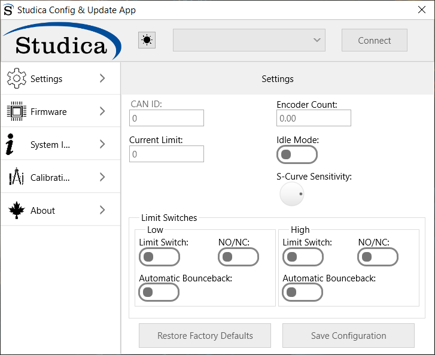
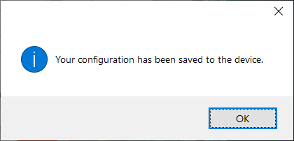
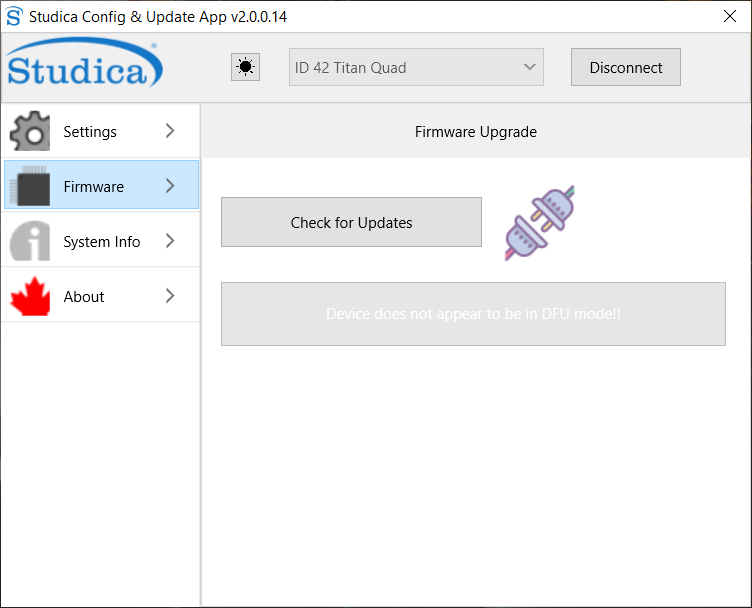
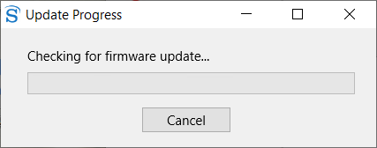
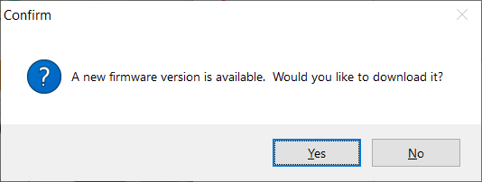
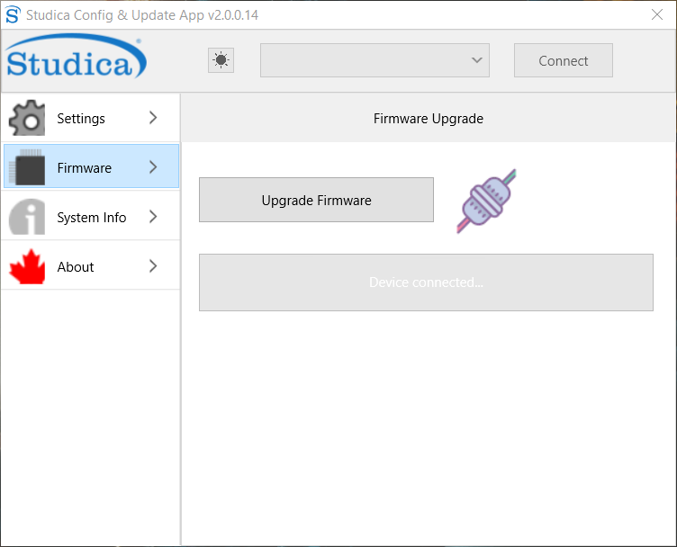
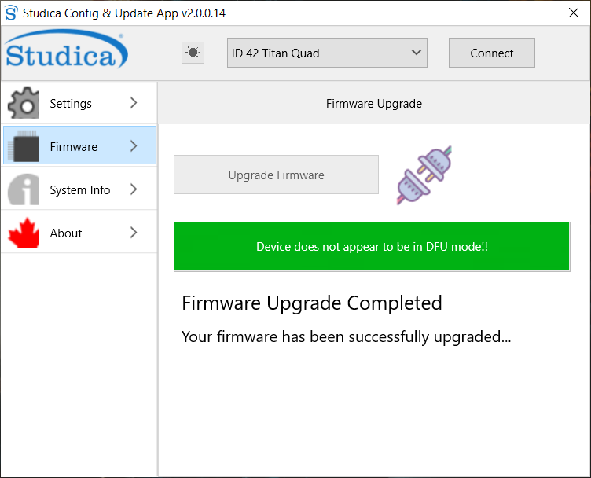
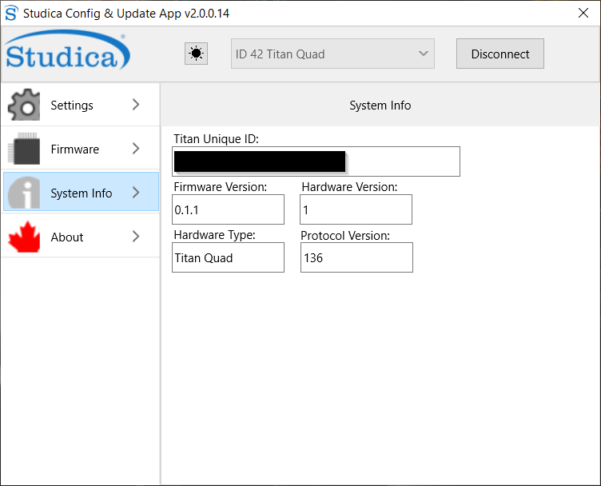
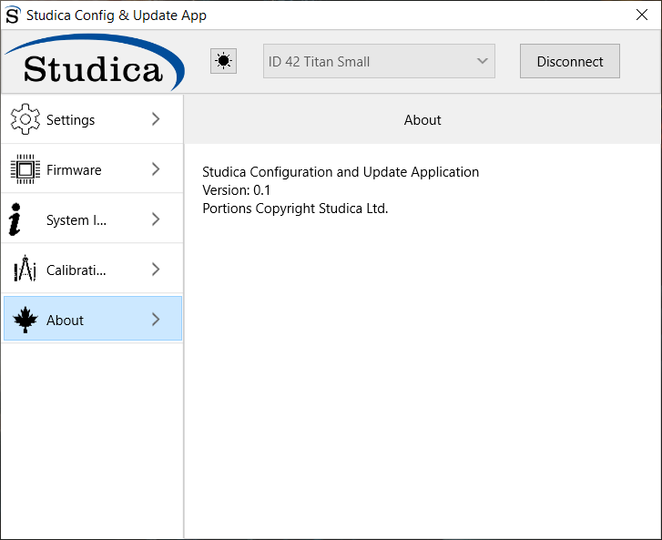

Using the Update App
====================

The Studica Update and Config app was created to allow users to get the most out of their TitanQuad motor controller. 

Settings
--------

The landing or Settings page allows for the setting of the custom CAN ID, Encoder Ticks per rev for the motor you are using, the current limit for the motors, Motor idle mode, S-curve sensitivity, and limit switch control. 

When the app finds a valid device, it will be displayed in the drop-down menu. 

.. note:: The default CAN ID out of the box is 42. 

CAN ID
^^^^^^

The CAN ID is the unique id of the motor controller on the CAN bus. The valid range is 1 - 62. 

Encoder Resolution
^^^^^^^^^^^^^^^^^^

Is the counts per revolution of the encoder you are using on your motor. For example, the Studica Maverick has a CPR of 732, whereas the Pitsco Torquenado has a CPR of 1440. 

Current Limit
^^^^^^^^^^^^^

This is the limit you want for the amount of current to flow to the motors. Valid range 0 - 20A.

Idle Mode
^^^^^^^^^

When false, this sets the motors to coast mode, and when high, the motors are in break mode.

S-Curve Sensitivity
^^^^^^^^^^^^^^^^^^^

Sets the sensitivity level of the S-Curve formula.

Limit Switches
^^^^^^^^^^^^^^

Control panel for limit switch configuration. There are two limit switch ports per motor on the Titan, a high and a low. 

Parameters

-  **Enable** - simple enable and disable
-  **NO/NC**  - let the microcontroller know if you are using a NO contact or a NC contact (inverts the output)
-  **Automatic Bounce back** - upon making contact with the limit switch, the motor will move in the opposite direction just a bit.

Save Configuration 
^^^^^^^^^^^^^^^^^^

Saves the current settings to the TitanQuad. A prompt will confirm that settings have been saved.

Restore Factory Defaults
^^^^^^^^^^^^^^^^^^^^^^^^

Will restore the TitanQuad to it's recommended factory settings. 

Firmware
--------

.. important:: Internet connection is required to download firmware!

Every so often, a firmware upgrade is required to fix a bug or include new functionality. 

   
To update the firmware, navigate to the firmware tab and then hit check for updates.

.. note:: If the button is greyed out, you are not connected to the TitanQuad, hit connect in the upper right-hand corner.

A prompt will appear as it checks the version on the TitanQuad to the server version. 

   
If there is an update, another prompt will ask if you would like to download the new firmware.

   
Once downloaded, you can hit ``Upgrade Firmware`` to flash the new firmware to the TitanQuad. 

.. note:: To tell if the TitanQuad is in update mode check to see if the power indicators are green and the status light is off.

When complete, there will be an indicator saying that the firmware upgraded was completed.

System Info
-----------

System Information is used for diagnosing and contacting support.

   
.. important:: The Unique ID is required for any support tickets. 

About
-----

Necessary information about the app.

